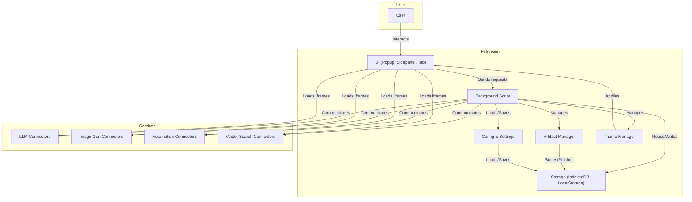

# 24_ProjectLogicAndAgentOnboarding.md

## Project Logic & Agent Onboarding Guide

### Purpose
This document provides a comprehensive overview of the current and intended logic of the ChatDemon project, onboarding notes for new agents/developers, and explicit working rules for all future work.

---

## 1. Project Logic Overview

- **Unified AI Service Management:** ChatDemon is a modular browser extension for managing, bridging, and interacting with various AI services (LLMs, image gen, automation, vector search) via a unified UI.
- **UI/UX:** Mimics Open WebUI in look, feel, and features, with enhancements for bridging, artifact management, and server management.
- **Iframe Integration:** Full UIs for services (Open WebUI, A1111, ComfyUI) are loaded in iframes in tabs/panels. Custom chat UI for LLMs without their own UI.
- **State Management:** Robust state management for tab/panel switching, session persistence, and artifact storage.
- **Import/Export:** Settings, servers, and artifacts can be imported/exported as JSON.
- **Theme Management:** Centralized theme system with dynamic switching and no style overrides.
- **Modularity:** All code must be modular, use dynamic imports, and keep files <150 lines when possible.

---

## 2. Working Rules & Protocols

- **Exclude `/backups`**: This directory is reserved for the backup script and should not be used for code or documentation.
- **Reference Only `/open-webui`**: Use this directory for inspiration and guidance, but do not copy code directly.
- **Modularity & Dynamic Imports:** Break code into small, reusable modules. Use dynamic imports for all non-core modules.
- **File Size:** Keep files below 150 lines when possible. Split logic into smaller files as needed.
- **Backup:** Always run the backup script before major changes. All backups are stored in `/src/backup`.
- **Check Before Writing:** Always check if a file or directory exists before creating or editing.
- **Logging:** Maintain a log of all file and code edits for potential rollback.
- **Commit Policy:** Only commit error-free code. Commit to git and backup source files after each major change.
- **Autopilot Mode:** Never stop unless all requirements are met or the user instructs otherwise.

---

## 3. Onboarding Notes for Agents/Developers

- **Read all documentation in `/md` before starting.**
- **Follow the Agentic Automation Protocol** (see `22_ImplementationPrompt.md`).
- **Review the current issues and roadmap** before making changes.
- **Use the backup and commit scripts as part of your workflow.**
- **All new features must be documented and tested.**
- **UI/UX must match or exceed Open WebUI in quality and features.**
- **All features must be accessible from the UI.**
- **Import/export, theme switching, and artifact management must be robust and user-friendly.**

---

## 4. Architecture Summary

- **UI:** Popup, sidepanel, and tab views, all React-based, with centralized theme and state management.
- **Background Script:** Handles extension lifecycle, message routing, and service connector management.
- **Service Connectors:** Modular connectors for LLMs, image gen, automation, and vector search, each implementing a common interface.
- **Storage:** IndexedDB and LocalStorage for settings, servers, and artifacts.
- **Artifact Manager:** Handles storage, search, and management of generated artifacts.
- **Theme Manager:** Centralized theme switching and application.

---

## 5. Mermaid Diagram

Below is a high-level architecture diagram for ChatDemon:

---

## 6. Quick Checklist for New Agents

- [ ] Read all `/md` docs
- [ ] Review issues and roadmap
- [ ] Run backup script before changes
- [ ] Use modular, dynamic imports
- [ ] Keep files <150 lines
- [ ] Document and test all changes
- [ ] Commit and backup after each major change
- [ ] Never stop unless all requirements are met or user instructs

---

*For any questions, consult the documentation or contact the project maintainer.* 