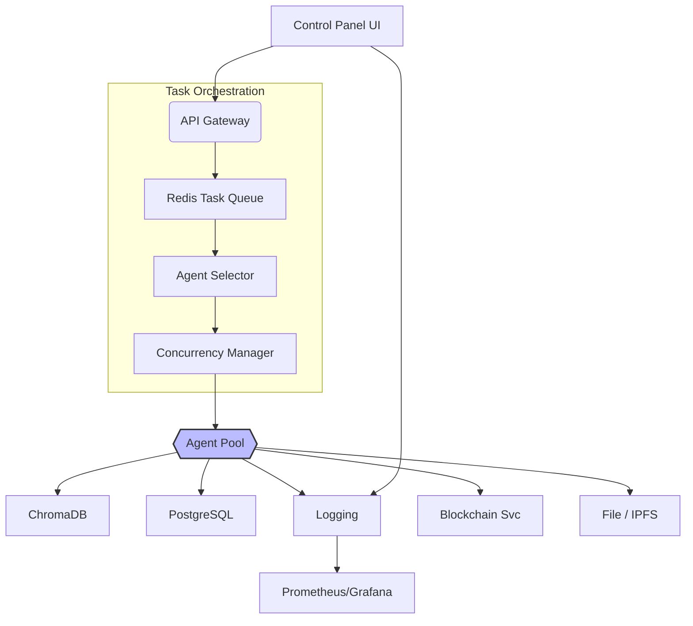

# Kind AI – Master Brainstorm Notes (Consolidated)

_Date: 2025-06-21_

> This document condenses the long free-form brainstorm (`01brainstorm.md`) into an organized reference. It captures key ideas for a modular, privacy-first, multi-agent AI Operating System (AOS) and its supporting projects.

---

## 1. Mobile & Wearable AI Mesh Concept

**Goal:** Run AI models on heterogeneous devices (phones, tablets, wearables, desktops) that auto-discover each other and share tasks over a local mesh.

• **Edge Inference Engines:** CoreML, TF-Lite, ONNX Runtime Mobile, PyTorch Mobile.  
• **Communication:** WebRTC / WebSocket, ZeroMQ, mDNS, Reticulum (LoRa) fallback.  
• **Coordinator:** Optional hub node schedules tasks based on device capacity.  
• **Security:** E2E encryption, pre-shared keys or QR pairing.  
• **Use Cases:** Classroom assist, field research, off-grid mesh, private companion.

---

## 2. Kind AI Core Philosophy

1. **Privacy by Default** – All compute & storage local; cloud optional.  
2. **Modular Agents** – *SomethingKind* naming (e.g., CompanionKind, MedKind).  
3. **Mesh First** – Devices announce capabilities & subscribe to tasks.  
4. **Humor & Humanity** – Light-hearted startup messages, friendly personas.

### Core MVP Modules
| Module | Purpose |
| ------ | ------- |
| SecurityManager | Keys, vault, permissions, backups |
| AgentManager | Load/unload agents, lifecycle & quotas |
| CommsMesh | P2P messaging over WS/ZeroMQ/mDNS/Reticulum |
| VectorMemory | ChromaDB vector store, RAG hooks |
| ArtifactStore | Files, media, prompt assets |
| FrontendManager | Tauri/React chat UI & admin panel |
| PackageManager | Install/upgrade persona modules |

---

## 3. Baseline Personas (Installable)

| Persona | Brief | Humor Quirk |
|---------|-------|------------|
| CompanionKind | Daily chatmate & orchestrator | "I brew ideas faster than coffee ☕" |
| MedKind | Health logs & alerts | "Your heart rate is rock-steady like a metronome." |
| VaultKind | Encrypted data & consent ledger | "Secrets? My lips are zipped with AES-256." |
| FlowKind | Task & routine planner | "Let's kanban your life, minus the sticky notes." |
| PromptKind | Prompt library & templates | "I hoard prompts like squirrels hoard acorns." |
| DietKind | Nutrition coach | "One cookie = 12 push-ups… just saying." |
| GrowKind | Smart garden helper | "Photosynthesize the day, my leafy friends!" |

---

## 4. High-Level Architecture

Full sequence & backup diagrams live in `/designs/` (see `chat-ui.mmd`, `backup_flow.mmd`, `installer_flow.mmd`).

---

## 5. Server Image Build Plan (GPU-ready)

1. **Phase 0 – Design**: Confirm stack versions, secrets strategy.  
2. **Phase 1 – OS & GPU**: Ubuntu 22.04, NVIDIA drivers, CUDA, nvidia-docker2.  
3. **Phase 2 – Core Services**: Docker Compose for Redis, Postgres, Chroma, Nginx.  
4. **Phase 3 – Backend & Agents**: FastAPI + Celery workers (+ Ollama on host).  
5. **Phase 4 – Frontend & Docs**: React build served via Nginx, Docusaurus docs.  
6. **Phase 5 – Config & Scripts**: Unified `.env`, `installer.sh`, `backup_data.sh`.  
7. **Phase 6 – ISO Build & QA**: Packer creates bootable image, run test suite.

See `aos_multi_gpu_build_plan.mmd` in designs for full detail.

---

## 6. Backup & Installer Flows

Backup and installer sequence diagrams are included in `/designs/`:
• `backup_flow.mmd` – UI → FastAPI → Cron → `backup_data.sh` steps.  
• `installer_flow.mmd` – Config UI writes `install.conf`, triggers `installer.sh`.

---

## 7. Phased Roadmap Toward Decentralization

| Phase | Focus | Duration | Highlights |
|-------|-------|----------|------------|
| 0 | MVP Core (solo dev) | 6-12 mo | Self-hosted AOS, Ollama, Control Panel, abstracted hooks |
| 1 | Polish & Attract | 6-9 mo | MFA, Prometheus, IPFS (local), DID testnet, open source |
| 2 | Federation Alpha | 9-18 mo | Secure P2P, ACC testnet, private IPFS swarm |
| 3 | ACC Mainnet | long-term | Tokenomics, DAO, marketplace, bridges |

All design guidelines (API versioning, modular upgrades, feature flags) are captured in `phase_pathway.md`.

---

## 8. LoraNet (ResilientLoRaChain)

Low-power off-grid mesh using ESP32 + LoRa & Reticulum.

• **DPoS Blockchain:** 200-byte CBOR blocks, 21 validators.  
• **Power Audit:** Signed voltage readings classify nodes `CLASS_0` / `CLASS_1`.  
• **Channels:** Consensus, Telemetry, Messaging.  
• **Phases:** Networking → Blockchain → Power audit → Disaster apps.

Details live in `loranet_overview.md`.

---

## 9. Next Steps

1. Finalize Kind AI Core repo scaffold (`kindai/`).  
2. Generate Mermaid diagrams into SVGs for docs site.  
3. Implement PackageManager CLI (`kindai install medkind`).  
4. Draft BaseAIAgent + example CompanionKind.  
5. Prepare Packer template for GPU image.

---

**End of Consolidated Notes – authored by _O3 Assistant_** 