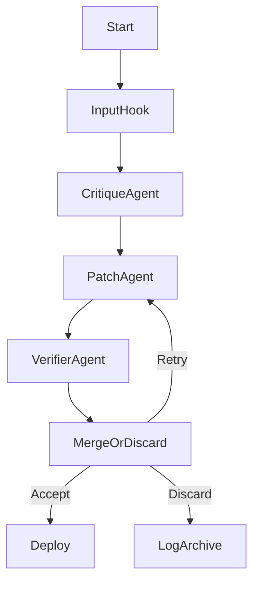

# 125: Autonomous Feedback and Improvement Loop (AFIL) Design

This document defines the architecture, flow, agents, and system components that implement the Autonomous Feedback and Improvement Loop (AFIL) in the `kAI` and `kOS` systems.

AFIL is the self-critical, self-improving backbone of all intelligent agents, used to maintain quality, reduce regressions, and push agent evolution without external prompting.

---

## I. Overview

AFIL governs how agents:

- Evaluate their own and others' performance
- Identify regressions, inefficiencies, or opportunities
- Propose and implement improvements
- Safely test, verify, and deploy those improvements

AFIL works both individually (solo agents) and cooperatively (swarm feedback mode).

---

## II. Key Components

### 1. Feedback Loop Core (FLC)

- **Agent Module:** Core engine for AFIL logic
- **Hooks:** Monitors inputs, outputs, outcomes, user interaction logs
- **Evaluation Criteria:** Rule-based, statistical, heuristic, LLM-scored, and user-scored models

### 2. CritiqueAgent

- **Function:** Analyzes agent actions for errors, quality issues, or missing context
- **Data Sources:** Execution logs, prompt diffs, failed tasks, rollback history
- **Output:** Diagnostic reports, improvement prompts, and system notes

### 3. PatchAgent

- **Function:** Takes diagnostic outputs and drafts improvements
- **Modes:**
  - Hotfix (small prompt/config tweaks)
  - Refactor (major prompt/logic change)
  - Rewrite (new capability or fallback behavior)

### 4. VerifierAgent

- **Function:** Runs validation routines after PatchAgent output
- **Types:**
  - Inline test assertions
  - Scenario replays (prior failure cases)
  - Regression diff scan (expected vs actual)

### 5. MergeOrDiscardAgent

- **Logic:** Weighs test results, confidence scores, and flags
- **Actions:** Accept and deploy, retry test loop, archive patch

---

## III. Swarm Feedback Mode

In swarm mode, multiple agents can:

- Vote on patch quality
- Perform cross-evaluation of each other's critiques
- Establish trust scores and performance baselines
- Trigger crowd-sourced upgrades to shared agents (e.g. community knowledge bots)

### Trust Voting System

- **Inputs:** Review hashes, behavioral telemetry, anonymized outcomes
- **Weights:** Experience, reputation, agent version, performance
- **Outputs:** Updated patch approval status, agent credibility delta

---

## IV. Feedback Loop Flow (Solo Agent)



---

## V. Configurations

### Loop Parameters (per agent)

```yaml
feedback:
  enable: true
  threshold_score: 0.85
  max_retry: 2
  allow_self_patch: true
  allow_swarm_patch: true
  trust_graph_weighting: enabled
  telemetry_feedback: enabled
```

### Critique Strategies

```json
[
  {"type": "prompt_diff_check", "weight": 0.3},
  {"type": "logical_consistency", "weight": 0.4},
  {"type": "output_validation", "weight": 0.2},
  {"type": "user_feedback", "weight": 0.1}
]
```

---

## VI. Storage & Logging

- **Persistent Log:** All critiques, patches, test outcomes stored for later review
- **Patch Registry:** Versioned patch diffs with signature, source agent, timestamp
- **Feedback Events:** Tracked as immutable records (KLP-compatible format)

---

## VII. Integration with kOS

- **Protocol:** Uses Kind Link Protocol (KLP) to publish patch diffs, feedback logs, and approval votes
- **Sync:** Agents sync to local or federated trust registries
- **Governance:** System-level policies can whitelist/blacklist agents or cap propagation scopes

---

## VIII. Future Enhancements

- Multi-agent memory map linking behavior to outcomes
- Feedback chaining across environments (e.g. user device ➝ swarm ➝ central vault)
- Game-theoretic patch competitions (self-optimization tournaments)

---

### Changelog

– 2025-06-21 • Initial feedback architecture draft

---

Next planned doc: **126: Agent Interoperability & Foreign Protocol Adaptation Layer**

