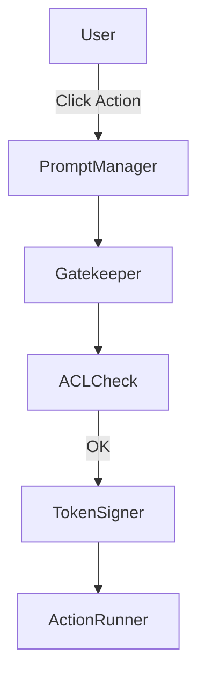

# 128: Security Enforcement & Access Control Modules

This document defines the architecture, agents, libraries, and enforcement flows responsible for security and access control within the `kAI` and `kOS` systems. The system ensures fine-grained permission control, user safety, auditability, and runtime integrity.

---

## I. Overview

Security and access enforcement are decentralized but federated under a unified trust and config schema.

- **Multi-layered Controls:** Authentication, authorization, sandboxing, rate limits
- **Audit-First Design:** All access requests and actions are logged
- **Declarative Policy Engine:** User and system rules defined as versioned configuration objects
- **Multi-mode Enforcement:** Local agent-level guards, central kOS security APIs, and optional blockchain notarization

---

## II. Core Components

### 1. Gatekeeper Agent (kOS)

- **Type:** Always-on system-level agent
- **Function:** Central authority for access permission checks and role-based policy distribution
- **Features:**
  - Identity verification via signed tokens (JWT, OIDC)
  - Policy retrieval and real-time updates
  - Quota management and abuse monitoring

### 2. Watchdog Agent (kAI)

- **Type:** Embedded system watcher
- **Function:** Monitors file access, resource usage, command execution
- **Features:**
  - Pattern-based allow/deny rules
  - Runtime flagging (suspicious memory, external calls)
  - Safe-mode reversion

### 3. ACL Manager (Shared)

- **Type:** Declarative policy resolver
- **Function:** Parses and enforces access control lists (ACLs)
- **Structure:**

```yaml
roles:
  - name: agent_editor
    permissions:
      - read: ["/services/**", "/config/**"]
      - write: ["/services/prompts/*"]
      - exec: []
  - name: super_admin
    permissions:
      - read: ["/**"]
      - write: ["/**"]
      - exec: ["/**"]
```

### 4. AuthService (API Middleware)

- **Libraries:** FastAPI, OAuthlib, pyjwt, python-pam (optional local auth)
- **Integrations:**
  - Federated login (OIDC / SSO)
  - Hardware keys (YubiKey, Trezor)
  - Biometric inputs (pluggable)

---

## III. Enforcement Modes

| Level         | Mechanism                   | Example Scenario                       |
| ------------- | --------------------------- | -------------------------------------- |
| Agent Sandbox | nsjail / Docker / firejail  | Prevent LLM from touching local files  |
| Role Guards   | ACL + policy engine         | Agent A cannot write to secrets vault  |
| Audit Trails  | Append-only log store       | Review password access attempts        |
| Token Expiry  | JWT lifetime + rotation     | Auto-logout for stale sessions         |
| Command Scope | Token-signed prompt actions | AI cannot spawn shell without approval |

---

## IV. Prompt-Level Security

Prompt actions can be permission-scoped and signed for execution.

```yaml
prompt:
  id: "delete_project"
  requires_permission: "project.delete"
  confirmation_required: true
  allowed_roles:
    - super_admin
```

### Prompt Signature Flow



---

## V. Config Schema

Stored at `/etc/kai/security/acl.yaml` or loaded from secure vault.

### Example User Config

```yaml
user:
  id: "user_23432"
  roles:
    - viewer
    - scheduler
  enforced_mfa: true
  device_trust_level: 0.92
```

### Agent Manifest Declaration

```yaml
agent:
  id: "llm_image_editor"
  capabilities:
    - file.write
    - prompt.respond
    - image.transform
  trust_tags:
    - audited
    - sandboxed
  max_execution_window: 3s
```

---

## VI. Logging & Auditing

All security events and requests are:

- Timestamped
- Authenticated
- Signed
- Stored in a local ring buffer and optionally pushed to:
  - KLP event stream
  - Blockchain-based audit layer
  - Syslog / Grafana Loki

---

## VII. Compliance Modes

- **Basic Mode:** Local auth, ACL YAML files
- **Enterprise Mode:** SSO + HSM key validation + SIEM integration
- **Anon Mode:** No auth but read-only restrictions enforced

---

## VIII. Future Enhancements

- Zero-trust network isolation for agent containers
- Posture-aware policy engine (device health, user behavior)
- Enclave-secured secret execution
- Security training loop for agents (simulated attacks + patching)

---

### Changelog

– 2025-06-21 • Initial security control module definition

Next: **129: Modular Prompt Manager Protocols and Enforcement Hooks**

