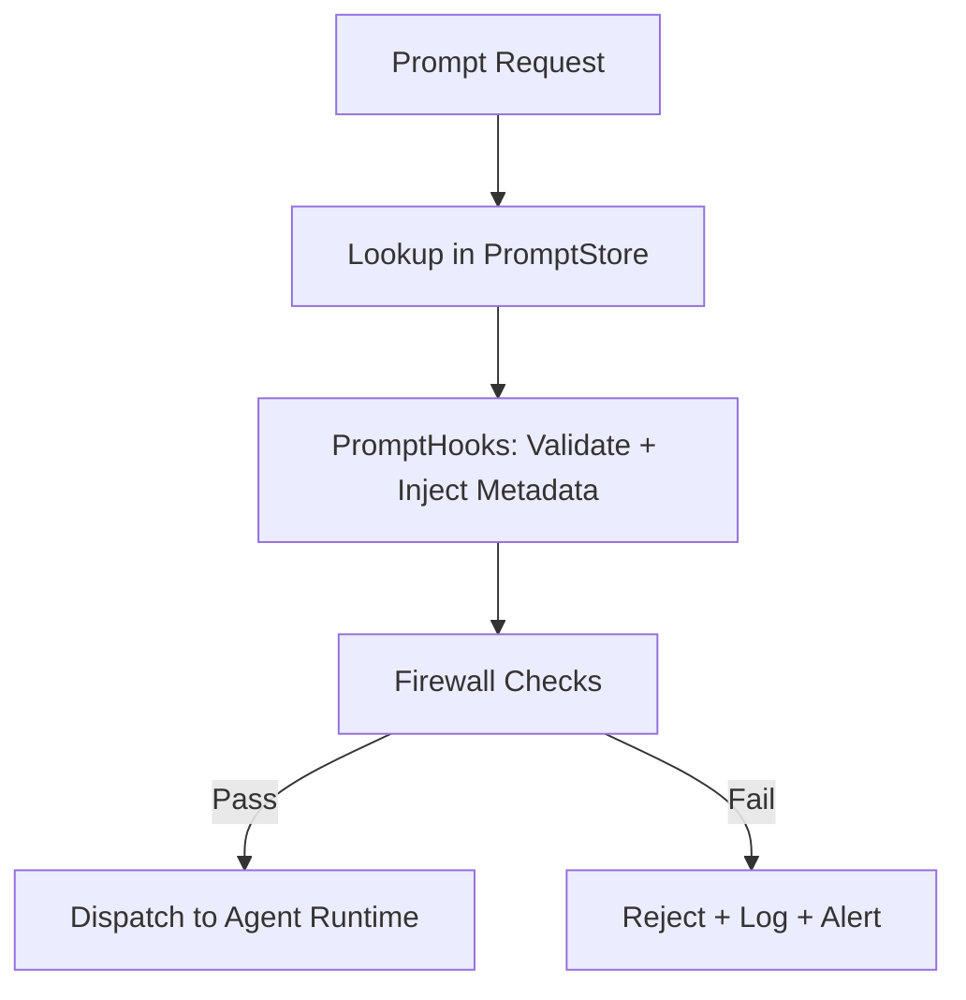

# 129: Modular Prompt Manager Protocols and Enforcement Hooks

This document outlines the full architecture, logic, APIs, and enforcement flow for the Modular Prompt Manager (MPM) system within `kAI` and `kOS`. The goal is to ensure secure, consistent, and adaptive control over prompt logic across agents and services.

---

## I. Purpose & Scope

The MPM ensures that all prompts:

- Adhere to safety, quality, and trust standards
- Are traceable, reproducible, and auditable
- Can be versioned, rolled back, and scoped by role, agent, or environment
- Include runtime enforcement hooks and sandboxing for behavior control

---

## II. MPM Core Components

### 1. Prompt Definition Module (PDM)
- YAML-based or JSON-based prompt schemas
- Metadata:
  - `id`, `version`, `description`, `author`, `role`, `allowed_callers`, `expiration`, etc.
- Types:
  - `static`, `template`, `chain`, `embedding`, `router`, `pre-prompt`, `post-prompt`

### 2. PromptStore
- Central version-controlled registry for all prompts
- Supports git-backed storage and patch diffs
- Namespacing: `agent_type/purpose/uuid.yaml`
- Auto-sync with swarm prompt cloud via KLP

### 3. PromptHooks Engine
- Middleware for:
  - Signature injection
  - Role verification
  - Contextual expansion (user history, memory)
  - Prompt fingerprinting
  - Parameter validation
- Plug-in based: easily extensible with new logic

### 4. Prompt Firewall (PFW)
- Real-time prompt auditing
- Hard fail or soft reject policies
- Pattern detection (injection, jailbreaks, unbound recursion)
- Trust boundary checks (e.g. elevated agent trying to impersonate user)

### 5. Prompt Sandbox
- Isolated runner for test/development/staging
- Load prompt + simulated memory + mock inputs
- Validate behavior deterministically

---

## III. Flow: Prompt Request Lifecycle



---

## IV. Example Prompt Schema (YAML)

```yaml
id: summarize_news
version: 1.3.2
role: news_analyst
allowed_callers:
  - kai.research.agent
  - kai.news.reader
parameters:
  - name: input_text
    type: string
    required: true
  - name: style
    type: enum
    options: [bullet, paragraph, tweet]
    default: bullet
prompt_template: |
  Please summarize the following news article into a {{ style }} format:
  ---
  {{ input_text }}
metadata:
  author: ai_admin
  created: 2024-12-12
  expires: 2025-12-31
```

---

## V. Prompt Enforcement Hooks

| Hook | Description | Fail Mode |
|------|-------------|-----------|
| `role_check` | Ensures caller agent is authorized | Hard fail |
| `token_guard` | Blocks prompts over token limit | Soft fail or truncate |
| `pattern_block` | Regex-based blacklist | Hard fail |
| `entropy_check` | Flags suspicious high-entropy templates | Warn only |
| `call_rate_limit` | Prevents abuse from repeated calls | Soft fail or delay |
| `memory_scope_guard` | Limits prompt's access to context | Hard fail |
| `parameter_type_guard` | Enforces declared parameter types | Soft fail |

---

## VI. Prompt Versioning & Audit

- Git-like commit logs with:
  - Author
  - Hash
  - Diff
  - Rationale / ticket ref
- Version rollback system per environment (dev/stage/prod)
- Prompt audit dashboard:
  - Usage metrics
  - Call graph
  - Failure reasons
  - Diff heatmap

---

## VII. API Examples

### GET Prompt Metadata
```http
GET /api/prompts/{id}
```

### POST New Prompt
```http
POST /api/prompts/
Content-Type: application/json
{
  "id": "qa_agent_parser",
  "template": "You are a QA bot...",
  "role": "qa_bot"
}
```

### Runtime Validation Call
```http
POST /api/prompts/validate
{
  "id": "summarize_news",
  "input_text": "...",
  "style": "bullet",
  "caller": "kai.research.agent"
}
```

---

## VIII. Integration with kOS

- All prompt metadata is exposed via KLP (Kind Link Protocol)
- Federated prompt registry support for distributed enforcement
- Role-to-agent mapping is fetched from Identity Manager module
- Sandbox outputs can be stored in AuditVault

---

## IX. Future Enhancements

- Differential prompt patch training via reinforcement feedback
- Swarm-wide prompt signature registry
- kLang compiler for high-level prompt logic DSL
- Prompt NFTs (signed & tradable capability definitions)

---

### Changelog
– 2025-06-21 • Initial full-stack prompt manager design

