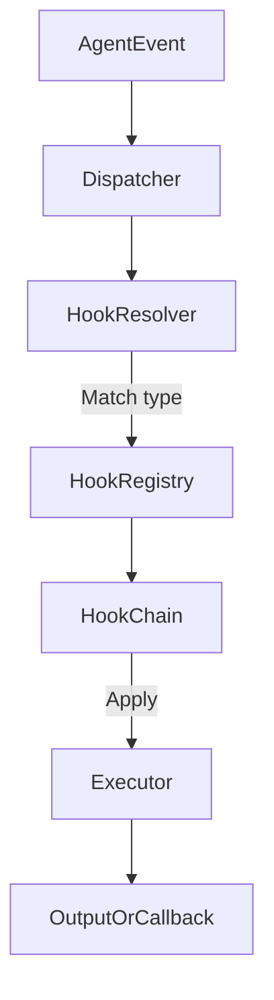

# 134: Execution Hooks & Inline Intelligence Binding

This document defines the `kAI` system's low-level architecture for inline code hooks, logic interceptors, and binding mechanisms that allow real-time execution layer intelligence.

Execution hooks enable proactive, context-aware intervention at runtime, especially in logic flows involving prompt chains, memory access, sensitive actions, and IO boundaries.

---

## I. Overview

Execution hooks are modular, pluggable functions embedded into the core runtime or wrapped around components, agents, and services. They intercept:

- Prompt input/output pipelines
- Agent function execution
- API calls and message passing
- Security-sensitive actions
- Environment or external system access

---

## II. Hook Types

### 1. `BeforePrompt` Hook

- Intercepts prompt inputs before dispatch
- Adds system prompt augmentation, safety, metadata tagging
- Injected via orchestrator

### 2. `AfterPrompt` Hook

- Intercepts generated outputs
- Scans for quality, hallucinations, leaks
- May trigger PatchAgent if threshold missed

### 3. `FunctionCallHook`

- Wraps internal logic function calls (tools, modules)
- Tracks usage patterns, errors, edge conditions

### 4. `IOHook`

- Binds to IO operations (e.g., file, network, db access)
- Flags suspicious or unauthorized access

### 5. `SecurityPolicyHook`

- Injects checks for data scope, agent permissions, trust-level gates
- Blocks, logs, or requests escalation

### 6. `DebugHook`

- Developer-attached loggers, variable capture
- Conditional breakpoints or streaming dumps

### 7. `ObservationHook`

- For passive agent analytics, telemetry, training feedback

---

## III. Hook Engine Architecture



---

## IV. Configuration

### YAML Sample:

```yaml
hooks:
  enable: true
  debug: false
  chain_mode: "cascade"
  registered:
    - name: hallucination_checker
      type: AfterPrompt
      priority: 10
      module: hooks/quality/hallucination.js
    - name: guardrails_enforcer
      type: BeforePrompt
      priority: 5
      module: hooks/security/guardrail.py
```

### Hook Properties

- `priority`: Defines order in chain (lower = earlier)
- `chain_mode`: `cascade`, `parallel`, `exclusive`
- `module`: Import path to handler logic

---

## V. Agent Inline Binding

Agents can declare inline hooks:

```ts
registerHook({
  type: 'FunctionCallHook',
  match: 'user_db.fetchUser',
  handler: (ctx, args) => {
    if (!ctx.hasPermission('read_user')) throw 'Blocked';
  }
});
```

---

## VI. Use Cases

- Dynamic prompt mutation
- Logging token counts
- Real-time hallucination feedback
- Block unsafe file access
- Inject watermark or trace code in image gen
- Emergency stop triggers for agents
- Rate limiting & quota enforcement
- Runtime feature flags

---

## VII. System-Level Hook Governance

- Root admin config defines global hook policy
- Hooks can be namespaced per agent, module, environment
- Secure hooks signed and verified on load
- Dev hooks require debug mode enabled

---

## VIII. Future Additions

- Visual editor for hook chain composition
- Hot reload of hook modules
- KLP-hook serialization for sharing
- Agent patching via remote hook injection

---

### Changelog

– 2025-06-23 • Initial draft complete

