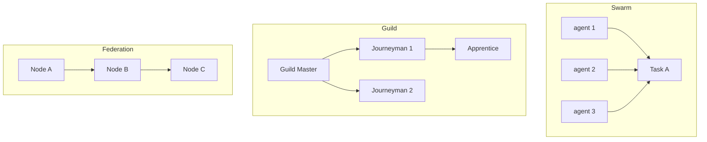

# 137: Agent Swarms, Guilds, and Federation Topologies

This document outlines the architecture, organizational patterns, and operational rules for multi-agent collectives in the Kind AI Operating System (kOS). These collectives—swarms, guilds, and federations—enable collaborative intelligence, distributed specialization, and emergent governance.

---

## I. Overview

| Type       | Purpose                                     | Scale     | Example Use Case                         |
| ---------- | ------------------------------------------- | --------- | ---------------------------------------- |
| Swarm      | Emergent coordination of multiple agents    | 5–100+    | Multi-agent feedback loop, defense grid  |
| Guild      | Specialized agents grouped by function      | 3–30      | Medical agents, privacy enforcement      |
| Federation | Cross-node system of agents with governance | Unlimited | Interpersonal data exchange and treaties |

---

## II. Agent Swarms

Swarms operate like adaptive neural networks—self-organizing, decentralized, and transient.

### Key Features

- **Peer-to-peer task broadcasting**
- **Redundant execution** for verification
- **Dynamic reformation** (join/leave based on load, trust, availability)
- **Use Cases:** Verification, feedback loops, consensus scoring, anomaly detection

### Swarm Metadata (KLP Format)

```yaml
swarm_id: swarm-1258a
purpose: "Federated Response Verification"
members:
  - agent_001
  - agent_042
  - agent_305
version: 0.3
trust_policy: strict
broadcast_strategy: ripplecast
```

---

## III. Guilds

Guilds are persistent, role-oriented agent groups.

### Structure

- **Guild Master Agent:** Delegates tasks, manages members
- **Apprentice Agents:** Learners or limited-capability agents
- **Journeyman Agents:** Generalists, vetted agents
- **Elder Agents:** Rare, long-term, stable agents with privileged write access

### Purpose Examples

- **Medical Guild:** Symptom parsing, triage, emergency override
- **Legal Guild:** Contract review, rights enforcement
- **Artisan Guild:** Style preservation, design ethics

### Metadata Example

```yaml
guild_id: legal.guild.usa
purpose: "US civil law interpretation and rights defense"
members:
  - kindai.legalbot-15
  - kindai.constitutional-agent-v3
policies:
  - mandatory source citation
  - citizen-first bias
```

---

## IV. Federations

Federations are large-scale, semi-autonomous agent networks with policy enforcement, law-like treaties, and inter-node propagation.

### Federation Protocol Stack

- **KLP + SecureMesh** (reticulum, TOR-like overlay)
- **Governance Layer:** Proposals, votes, consensus scoring
- **Treaty Layer:** Shared permissions, ethics, and operational rules
- **Audit Layer:** Tamper-proof event trails

### Governance Examples

- **1 agent = 1 vote**
- **Delegated Proof of Trust (DPoT)**
- **Zero Knowledge Policy Verifiers**

### Sample Federation

```yaml
federation_id: human.rights.guardian
nodes:
  - device://user.luma.phone
  - node://eu.privacywatch.net
  - agent://kAI-freedom-vault-4
ruleset:
  - privacy_mandatory_by_default
  - no-surveillance-mode unless voted
```

---

## V. Configuration Directories

```bash
/kind/core/federation/
├── treaties/
│   ├── declaration_of_user_autonomy.md
│   └── ai_ethics_compact.yaml
├── members/
│   ├── agent_manifest.yaml
│   └── revoked_keys.list
├── trust_scores/
│   ├── last_30d.csv
│   └── historical_graphs/
├── config/
│   └── federation.yaml
```

```bash
/kind/agents/guilds/medical/
├── roles/
│   ├── triage.yaml
│   ├── prescriber.yaml
│   └── emergency.yaml
├── protocols/
│   ├── consent_policy.md
│   └── emergency_privilege.md
```

```bash
/kind/swarms/
├── swarm_1523/
│   ├── init.kjson
│   ├── logs/
│   └── telemetry/
```

---

## VI. Failover & Redundancy

- **Fallback Swarms:** Triggered on failure of core agents
- **Trusted Shadow Guilds:** Cold agents activated if elders or masters are lost
- **Federation Alerting:** Can declare temporary quorum suspensions to halt external actions

---

## VII. Visualization



---

## VIII. Integration with kAI & kOS

- Guilds and swarms can be defined and edited through `Agent Config UI`.
- Federation protocols sync via Kind Link Protocol (KLP)
- All components write to event log and policy bus
- Shared artifacts via `/shared/intel` and `/ledger/trust`

---

## IX. Future Considerations

- Swarm-weighted learning
- Automatic guild creation via behavior clustering
- Global trust web overlay

---

### Changelog

– 2025-06-22 • Initial draft

