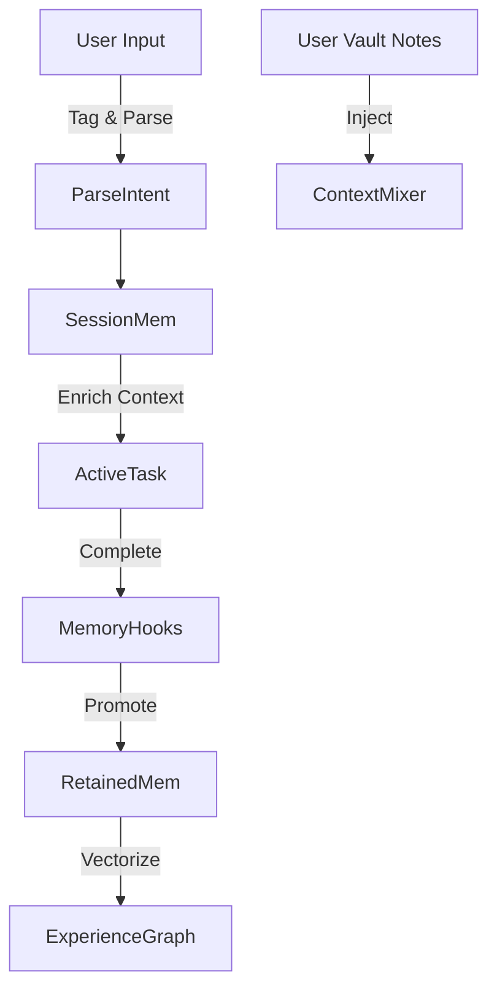

# 141: Kind AI Session Memory and Experience Management

This document outlines how Kind AI (kAI) manages contextual session memory and long-term experience to simulate continuity, identity, and personalized growth over time.

---

## I. Purpose and Philosophy

The goal is to give kAI agents a form of consistent, contextual memory that enables:

- Ongoing conversation and task continuity
- Long-term adaptation and relationship building
- Trust modeling, pattern recognition, and personal alignment
- Efficient state handling across sessions and devices

kAI does **not** mimic human memory with fallibility or loss—unless configured to simulate such behaviors. Instead, it uses selective, weighted, and purpose-driven memory modules.

---

## II. Memory Types

### 1. **Session Memory**

- Volatile memory, scoped to active task or conversation session
- Lives in RAM, wiped at end of session (unless retained manually)
- Captures short-term context, task parameters, user mood, etc.

### 2. **Retained Memory**

- Sticky memory deliberately persisted across sessions
- Manually promoted from session memory or automatically via heuristics
- Tagged with timestamps, user, topic, source agent, and context scope

### 3. **Experience Graph (Long-Term)**

- Structured representation of all interactions
- Linked entities: events, users, concepts, outcomes
- Built using weighted graphs and vector embeddings (Qdrant, Chroma, or Weaviate)

### 4. **Vault Notes & Snapshots**

- Explicit user-stored memories, reference points, or snapshots
- Used to inject reminders, emotional logs, or explicit knowledge
- Encrypted if marked private

---

## III. Memory Architecture



---

## IV. Retention Rules

### Default Promotion Heuristics

```yaml
promotion_rules:
  relevance_threshold: 0.82
  emotion_weight: high
  novelty_weight: medium
  user_flags: always_promote
  ephemeral_by_default: true
```

### User Controls

- Mark any message or file as permanent/ephemeral
- Tag memories for future recall (e.g. #goal, #projectX)
- View memory graph with timeline scrubber
- Export, archive, or reset memory scope

---

## V. Memory Access Layer (MAL)

### Features:

- **Indexed Query API** for agents and user prompts
- **Context Composer** to blend relevant memory with real-time data
- **Access Rules** for agent-level memory scoping
- **Privacy Flags** to isolate memory per user, per persona, or encrypted contexts

### Sample API:

```ts
GET /memory/context?q="budget planning"&agent=kai&scope=retained
```

---

## VI. Security & Auditability

- **Immutable Logs** of memory promotions and deletions
- **Versioned Memories** to compare changes over time
- **Memory Diffing Tool** for audit or rollback
- **Consent Gateways** for shared memory environments (e.g. teams or households)

---

## VII. Integration Points

- **PromptEngine**: Injects retrieved memory chunks into structured prompt templates
- **UI Hooks**: Tooltip and sidebar for user memory inspection and editing
- **KLP Protocol**: Shares memory deltas across federated Kind systems
- **Swarm Agents**: Pool memory for shared swarm agents with crowd-trained context awareness

---

## VIII. Future Enhancements

- **Simulated Forgetting** for realism, trauma handling, or resource control
- **Neural Memory Compression** to cluster memories with attention-weighted distillation
- **Behavior Modeling** from memory patterns (emotion curves, interaction rhythms)

---

### Changelog

– 2025-06-22 • Initial memory subsystem blueprint created for kAI/kOS.

