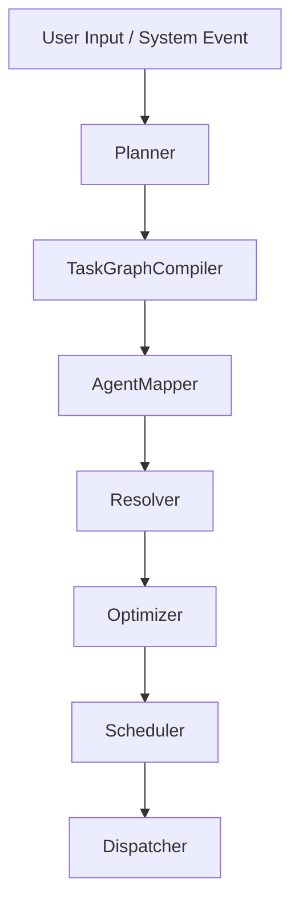

# 146: Multi-Agent Task Graph Compiler (MATGC)

This document defines the full architecture, design, components, and operational flow for the Multi-Agent Task Graph Compiler (MATGC) module within the `kAI` and `kOS` systems. MATGC is responsible for automatically compiling complex user goals or system objectives into optimized multi-agent execution graphs with dependency resolution, capability mapping, parallelization, and fallback linking.

---

## I. Overview

MATGC transforms user queries, high-level goals, or external system events into executable multi-agent task graphs.

- Converts abstract tasks into atomic, linked actions
- Resolves agent capability mapping and fallback chains
- Enables parallel execution, streaming results, adaptive branching
- Compiles to formal task graph DSL (Domain-Specific Language)
- Supports real-time re-compilation upon failure, feedback, or updated context

---

## II. Core Functional Pipeline



### Components

1. **Planner** – Performs high-level NLP decomposition
2. **TaskGraphCompiler** – Converts steps to formal task graph structure
3. **AgentMapper** – Maps graph nodes to known agent capability profiles
4. **Resolver** – Links any missing nodes to fallback methods or scaffold agents
5. **Optimizer** – Simplifies or parallelizes graph structure based on goals
6. **Scheduler** – Determines execution flow, priorities, and thresholds
7. **Dispatcher** – Executes compiled graph, monitors progress, and logs results

---

## III. Internal Graph DSL

The task graph format is expressed in JSON/YAML with the following core structure:

```yaml
task_id: plan_8972a
origin: user_request
entry_node: research_paper_search
nodes:
  research_paper_search:
    type: search
    params:
      query: "most cited papers on agent coordination"
    outputs: [summary_generation]

  summary_generation:
    type: llm_summarize
    agent: kai.summarizer
    inputs: [research_paper_search]
    outputs: [output_validation]

  output_validation:
    type: critique
    agent: kai.critic
    inputs: [summary_generation]
    outputs: [final_delivery]

  final_delivery:
    type: delivery
    agent: kai.presenter
    inputs: [output_validation]
```

---

## IV. Agent Capability Mapping

Agents register capability signatures:

```json
{
  "agent": "kai.extractor",
  "capabilities": [
    {
      "type": "scrape_url",
      "inputs": ["url"],
      "outputs": ["html"],
      "constraints": ["rate_limit=5/min"]
    },
    {
      "type": "summarize_text",
      "inputs": ["html"],
      "outputs": ["summary"]
    }
  ]
}
```

The compiler links node types to matching agents with compatible interfaces and constraints.

Fallbacks are applied using:

- Functionally equivalent agents
- API fallback integrations
- On-the-fly template generation

---

## V. Optimization Techniques

- **Subgraph folding** – Collapse redundant chains
- **Batch parallelism** – Group similar tasks across documents/inputs
- **Streaming flow** – Forward partial results downstream as they become available
- **Timebox constraints** – Prioritize tasks by urgency or deadline
- **Device affinity** – Optimize for local vs cloud execution

---

## VI. Configuration Schema

```yaml
compiler:
  enable_parallel: true
  enable_fallback_agents: true
  trust_score_threshold: 0.65
  max_graph_nodes: 128
  retry_policy:
    attempts: 2
    backoff: 3
```

---

## VII. Integration with kAI and kOS

- Accessible via API and prompt-based orchestration commands
- Automatically stores compiled graphs in kOS vault
- Graph execution logs stream into Observation DB and AFIL feedback loops

---

## VIII. Visualization

Task graphs are rendered via:

- Mermaid graphs in UI console
- Interactive React DAG visualizer (`react-flow-renderer`)
- Export to PDF/SVG via `taskgraph/export` endpoint

---

## IX. Future Features

- Autonomous Graph Editor agent
- Graph version diffing and changelog views
- Reward-based optimization tuning (RLHF from user feedback)

---

### Changelog

– 2025-06-21 • Initial draft of MATGC blueprint

---

Next planned doc: **147: Agent Lifecycle, Versioning & Retirement Protocols**

