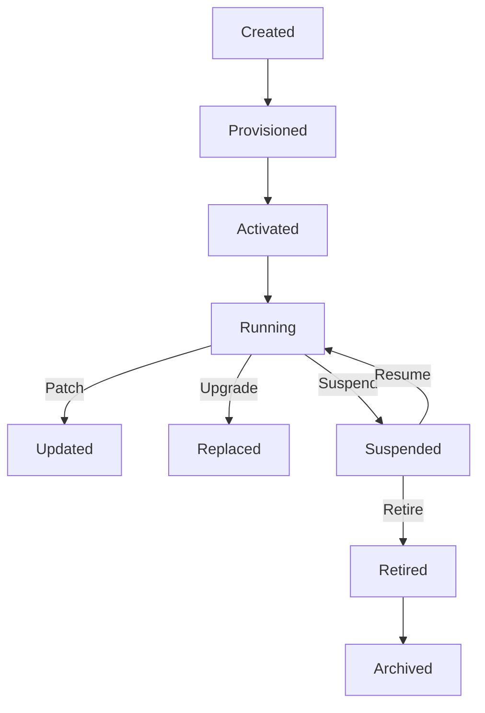

# 147: Agent Lifecycle, Versioning & Retirement Protocols

This document defines the complete lifecycle of agents in the `kAI` and `kOS` ecosystem, including provisioning, active service, versioning, patching, reassignment, suspension, and eventual retirement or archival.

This protocol ensures safe deployment, graceful fallback, and accountability across all environments—local, federated, and cloud-distributed.

---

## I. Agent Lifecycle States



---

## II. State Definitions

### 1. `Created`

- Agent defined in manifest but not initialized
- Assigned UUID, creation metadata

### 2. `Provisioned`

- Assigned hardware, memory, and environment
- Receives token-scoped credentials or capabilities
- Linked to namespace (e.g. user, org, swarm)

### 3. `Activated`

- Begins initial prompt injection and memory mapping
- Registers with relevant task routers and control planes

### 4. `Running`

- Fully operational and callable
- May execute user or system tasks
- Logs telemetry, outputs, context windows

### 5. `Updated`

- Receives patches or prompt hotfixes via AFIL
- Preserves lineage and patch history
- Triggers re-verification tests automatically

### 6. `Replaced`

- Migrated to a newer version
- Older version flagged as superseded
- Optional shadow-mode retained for fallback

### 7. `Suspended`

- Disabled from taking new tasks
- Memory and state snapshot saved
- Typically triggered by admin, error, or security policy

### 8. `Retired`

- No longer active in execution pipeline
- Metadata and patch history retained

### 9. `Archived`

- Exported to long-term storage
- Can be restored by explicit governance override

---

## III. Versioning Protocol

```yaml
versioning:
  scheme: semantic
  format: MAJOR.MINOR.PATCH
  tag_conventions:
    - hotfix
    - stable
    - experimental
    - beta
    - deprecated
```

- **Patch** – Bugfix or minor prompt tweak (non-breaking)
- **Minor** – New capability or integration (backward-compatible)
- **Major** – Structural or behavioral change (breaking or significant)

### Auto-Tagging Examples:

- `v2.0.0-beta` – In testing phase with major prompt overhaul
- `v1.9.3-hotfix` – Emergency patch due to discovered regression

---

## IV. Retirement Triggers

- Superseded by newer version
- Repeated failures or low trust score in AFIL
- Security compromise or token invalidation
- Deprecated due to architectural change
- Manual admin override or governance flag

---

## V. Configuration Snippet

```yaml
agent_lifecycle:
  allow_retire_on_patch_failures: true
  suspend_on_token_revocation: true
  max_shadow_versions: 2
  archive_expired_retirements_after_days: 30
  enforce_signature_on_upgrade: true
```

---

## VI. Trust & Audit Layer

- **Digital Signature Check** – Required for all major upgrades
- **AFIL Trust Score** – Used to determine continued eligibility
- **Retirement Ledger** – Immutable log of reason, time, and governing entity
- **Dependency Graph Audits** – Prevent removal of critical agents in use

---

## VII. Governance Interface

Agents may be force-retired or reinstated by:

- Local user control panel
- Federated governance cluster
- System auto-action triggered by policy

---

### Changelog

– 2025-06-21 • Initial lifecycle draft

---

Next planned doc: **148: Self-Healing Mesh Routing and Redundancy Fabric (SHMRF)**

