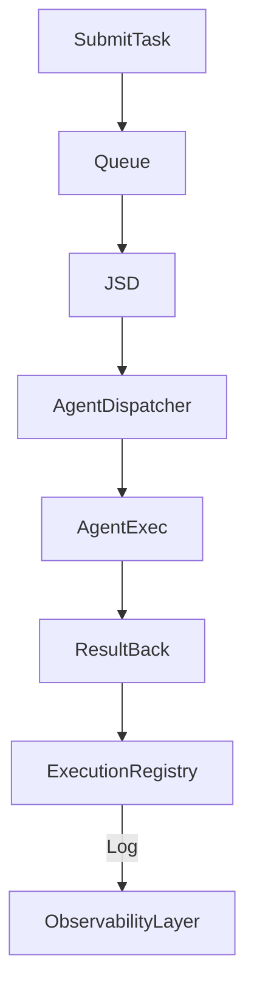

# 153: Distributed Job Scheduler & Task Execution Protocols

This document defines the design, protocols, and logic for the distributed job scheduler and task execution system within the `kAI` and `kOS` ecosystems. This includes distributed queueing, prioritized execution, agent handoffs, execution guarantees, and system-level instrumentation for observability.

---

## I. Purpose

Enable `kAI` and `kOS` agents to:
- Distribute task execution across systems and devices
- Perform load-balanced job routing
- Execute high-priority or real-time tasks reliably
- Track progress, failures, and retry history
- Chain and orchestrate multi-step workflows with dependencies

---

## II. Scheduler Components

### 1. Job Scheduler Daemon (JSD)
- Local agent daemon or background service
- Consumes jobs from queue and dispatches to appropriate agent
- Implements retry/backoff, escalation, and failover

### 2. Execution Registry (ER)
- Tracks which agent handled which task
- Holds job metadata, timestamps, and result hashes
- Supports task deduplication, chaining, and audit logs

### 3. TaskQueue Adapter (TQA)
- Abstract interface for queue backends:
  - Redis Streams
  - RabbitMQ
  - NATS
  - ZeroMQ
  - SQLite WAL fallback

### 4. AgentDispatcher
- Maps job types to local or remote agents
- Ensures required model, compute, or config is present
- Performs warm-up (load model/weights) as needed

### 5. Supervisor Monitor
- Watches health of execution pipeline
- Can reassign stalled or crashed jobs
- Provides telemetry to Observability Layer

---

## III. Job Structure

```json
{
  "id": "task-123",
  "type": "image_generation",
  "priority": "high",
  "payload": { ... },
  "dependencies": ["preprocess-xyz"],
  "timeout": 120,
  "retry": 3,
  "sender": "agentA",
  "receiver": "agentB"
}
```

- `type`: Determines which module or agent to dispatch to
- `dependencies`: Ensures prior tasks completed successfully
- `priority`: Levels (low, normal, high, critical)
- `retry`: Retry count; exponential backoff applied

---

## IV. Dispatch Flow (Mermaid)



---

## V. Configuration

### Scheduler Settings (`scheduler.yaml`)
```yaml
job_timeout_default: 90
retry_backoff: exponential
max_retry: 5
default_queue: redis
priorities:
  critical: 100
  high: 75
  normal: 50
  low: 25
heartbeat_interval: 5
telemetry: true
```

### Queue Backend Example (Redis)
```yaml
queue:
  backend: redis
  host: 127.0.0.1
  port: 6379
  db: 1
  stream_prefix: kai-job
```

---

## VI. Agent Handshake & Handoff Protocol

- Agents register with `AgentRegistry` on boot
- Jobs carry target `receiver` (specific agent) or `role` (e.g., "LLMService")
- AgentDispatcher resolves role to running instance
- Secure handshake (KLP signed)

```json
{
  "type": "job_handoff",
  "job_id": "abc123",
  "receiver": "agent-b",
  "payload_hash": "abc...xyz",
  "signature": "KLP-sig:..."
}
```

---

## VII. Observability Hooks

- Event stream with lifecycle events:
  - job_submitted
  - job_started
  - job_completed
  - job_failed
  - job_retried
- Metrics pushed to Prometheus-compatible endpoint:
  - jobs_per_agent
  - retry_counts
  - failure_rate
  - average_latency

---

## VIII. Execution Guarantees

| Guarantee           | Method                                       |
|---------------------|-----------------------------------------------|
| At-Least-Once       | Acknowledgment required for job deletion      |
| At-Most-Once        | Ephemeral delivery, no retry                  |
| Exactly-Once (planned) | Idempotency tokens, result hashing        |

---

## IX. Future Enhancements

- Web UI dashboard for job visualization and manual override
- Predictive load distribution based on telemetry
- Decentralized queue sync across LAN peers
- Secure job contracts (zero-knowledge) for sensitive execution
- Memory snapshots and rollback

---

### Changelog
– 2025-06-22 • Initial draft of distributed scheduler architecture

