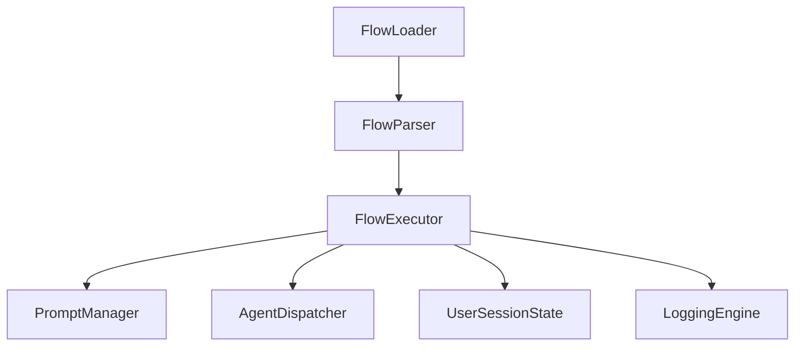

# 154: Prompt Flow DSL & Runtime Execution Engine

This document defines the Prompt Flow Domain-Specific Language (DSL) and the architecture of its runtime execution engine used within `kAI` and `kOS`. This system allows declarative and procedural definition of complex, multi-step prompt interactions, chaining agents, handling user input, and integrating external tools.

---

## I. Purpose

The Prompt Flow DSL enables modular, reusable, and composable AI prompt sequences, with control flow, variable management, branching, error handling, and response validation.

The runtime engine interprets and executes these DSL-defined flows.

---

## II. DSL Syntax Overview

### 1. Basic Structure

```yaml
id: onboarding_wizard
name: User Onboarding Wizard
tags: ["user", "setup"]
version: 1.0
steps:
  - id: welcome
    type: prompt
    message: "👋 Hello {{user.name}}! Welcome to Kind AI. Shall we begin your setup?"
    options:
      - label: "Yes"
        next: collect_email
      - label: "No"
        next: goodbye

  - id: collect_email
    type: input
    message: "📧 What's your preferred email address?"
    variable: user.email
    validate:
      regex: "^[\w.-]+@[\w.-]+\.\w{2,}$"
      on_fail: retry

  - id: goodbye
    type: prompt
    message: "No worries. You can start setup anytime by saying 'begin onboarding'. 👋"
    end: true
```

---

## III. Step Types

### A. `prompt`

- Sends message to user.
- Supports templating and option branching.

### B. `input`

- Waits for typed or spoken input.
- Assigns result to a named variable.
- Supports regex, choices, function-based validation.

### C. `function`

- Calls internal or external function.
- Can return result into a variable.

### D. `agent`

- Delegates control to another agent or flow.
- Can be blocking (wait for return) or fire-and-forget.

### E. `condition`

- Branches logic based on variable values or function results.

### F. `end`

- Terminates the current flow with optional result.

---

## IV. Variables

- Global and local scopes
- Nested properties: `user.name`, `session.context.role`
- Reserved system vars: `__time__`, `__input__`, `__agent__`
- Mutation functions: `set`, `append`, `merge`, `delete`

---

## V. Runtime Engine

### Architecture



### Components

- **FlowLoader**: Loads YAML/JSON flows from disk or DB
- **FlowParser**: Validates and compiles flow to internal graph
- **FlowExecutor**: Traverses and executes flow logic
- **PromptManager**: Interfaces with UI/voice/chat delivery
- **AgentDispatcher**: Sends tasks to external agents
- **UserSessionState**: Stores conversation variables
- **LoggingEngine**: Captures run logs, errors, responses

### Supported Platforms

- Web (kAI web chat)
- Browser extension (kAI-CD)
- CLI + TUI
- Voice + AR interface

---

## VI. Advanced Features

### A. Subflows and Includes

- Include and embed reusable subflows

### B. Error Handling

```yaml
on_error:
  match: timeout
  next: retry_step
  fallback: support_agent
```

### C. Flow Versioning

- All flows versioned with semantic versioning
- Runtime supports pinning to specific versions

### D. Tool & API Integrations

- Steps can call tools (e.g. calculator, converter, fetcher)
- Agents may expose callable functions

### E. Dynamic Flow Generation

- Support for real-time LLM-generated flows
- Audit and wrap with guard rails and simulation previews

### F. UI Schema Embedding

```yaml
ui:
  component: form
  fields:
    - name: email
      type: email
      label: "Your Email"
      required: true
```

---

## VII. Example Use Cases

- Onboarding assistant
- Technical troubleshooting wizard
- Personalized learning tutor
- Research agent with topic selection
- Data labeling assistant
- Self-diagnosing prompt debugger

---

## VIII. Storage & Deployment

- **File format:** `.flow.yaml` or `.flow.json`
- **Registry:** Indexed by agent role, version, category, language
- **Deployment:** Hot-reload via FlowLoader daemon

---

## IX. Security Considerations

- Sanitize templated outputs
- Validate all user inputs
- Escape flow-injected values
- Signature and hash validation of registered flows

---

## X. Future Features

- Graph editor UI for creating flows
- Flow diff and merge tools
- Auto-generated flow tests based on historical user sessions

---

### Changelog

– 2025-06-22 • Initial complete draft of Prompt Flow DSL & Execution Engine

