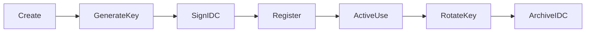

# 159: Agent-Specific Cryptographic Identity & Signing Layer

This document defines the identity architecture for all agents within the `kAI` framework and `kOS` system, focusing on cryptographic key management, identity issuance, trust propagation, and signature enforcement.

---

## I. Purpose & Goals

- Guarantee the authenticity of agent actions
- Enable decentralized agent verification across networks
- Support agent identity revocation and versioning
- Provide signed provenance of agent-generated content
- Facilitate secure communication and patch submission

---

## II. Identity Structure

### A. Core Identity
Each agent is assigned a unique cryptographic identity at creation.

```yaml
agent_id: kai-004-dev-chat
public_key: <Ed25519 public key>
private_key: <Ed25519 private key> (sealed)
creation_time: 2025-06-21T17:00:00Z
agent_version: v0.1.3-dev
```

### B. Identity Card (IDC)
Signed, exportable JSON-LD structure containing:

```json
{
  "@type": "AgentIDCard",
  "agent_id": "kai-004-dev-chat",
  "public_key": "...",
  "issuer": "kOS Identity Authority",
  "agent_type": "chat",
  "trust_level": 3,
  "valid_from": "2025-06-21T17:00:00Z",
  "expires": "2026-06-21T00:00:00Z",
  "signature": "..."
}
```

---

## III. Key Generation & Management

- **Algorithm:** Ed25519 (default), secp256k1 (optional, for interop)
- **Generation Tool:** `kai-keygen`
- **Storage:**
  - Agent-side: In sealed vault or encrypted local key store
  - kOS master authority: stores public key + trust score
- **Rotation:**
  - Triggered on version change or detected compromise
  - New ID issued, previous ID archived

---

## IV. Signature System

### A. Signing Use Cases
- Prompt configurations
- Content and artifact generation
- Toolchain selection
- Service request calls
- Feedback or critique diffs (AFIL patches)

### B. Signing Method
- Deterministic Ed25519 using canonicalized JSON of payload
- Hashing: SHA-256 preimage before signing
- Output includes `agent_id`, `timestamp`, `payload`, and `signature`

### C. Verification API
```http
POST /api/verify_signature
{
  "payload": { ... },
  "agent_id": "kai-001-core-doc",
  "signature": "base64..."
}
```
Returns:
```json
{
  "verified": true,
  "trusted": true,
  "issuer": "kOS Identity Authority",
  "trust_level": 4
}
```

---

## V. Identity Issuers

### A. Local Issuer
- For self-contained deployments
- kOS system acts as root CA
- All IDCs issued locally and valid in local trust domain

### B. Federated Authority (Future)
- Distributed kOS nodes establish interlinked Web-of-Trust
- Cross-domain agent validation
- Revocation propagation via Kind Link Protocol (KLP)

---

## VI. Agent Identity Lifecycle



---

## VII. Revocation & Blacklisting

- **Revocation List Format:**
  - JSONL or Merkle log
  - Includes reason, timestamp, revoker, proof
- **Distribution:**
  - Pulled via KLP
  - Available on kOS discovery nodes

---

## VIII. Privacy & Delegation

- **Pseudonymous Agents:** Use salted IDCs, short-lived keys
- **Subagent Delegation:**
  - Parent agent signs ephemeral delegation tokens
  - Usage constraints embedded in delegation token

---

## IX. Configuration Example

```yaml
identity:
  enable_signing: true
  keypair_path: ~/.kai/keys/agent_key.ed25519
  issuer: "local"
  idc_cache: ~/.kai/idc/
  verify_on_input: true
  sign_outputs: true
  rotation_policy:
    on_version_change: true
    interval_days: 90
```

---

## X. Future Enhancements

- DID (Decentralized ID) integration for cross-protocol compatibility
- Zero-Knowledge signature schemes for privacy-preserving proof
- Smart contract-bound identities on blockchain for public agents

---

### Changelog
– 2025-06-21 • Initial agent crypto-identity and signing framework

