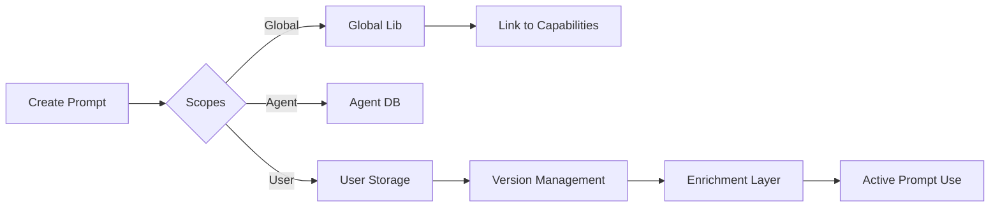

# 182: Prompt Management System – Modular Prompt Storage, Sync, and Enrichment Engine

## Summary

This document defines the full architecture, storage schema, and protocol interfaces for the Prompt Management System (PMS) within the kAI/kOS ecosystem. The PMS manages all prompt templates, prompt runs, versions, metadata, and enrichment routines for both agents and users.

---

## Purpose

To provide:

- A centralized prompt database with agent- and user-scoped prompts
- Modular prompt templates with versioning, tags, source attribution, and history
- Smart enrichment modules (e.g., context injection, memory merging, task alignment)
- Programmatic and GUI access to prompt management and linking

---

## Directory Structure

```
kOS/core/prompt/
├── engine/
│   ├── linker.py               # Link prompts to capabilities
│   ├── enricher.py             # Inject context/memory/meta
│   └── validators.py           # Prompt validation logic
├── models/
│   ├── prompt_model.py         # SQLAlchemy prompt table schema
│   ├── prompt_version.py       # Versioned prompts
│   └── prompt_meta.py          # Tags, source, notes, user/agent
├── api/
│   ├── routes.py               # FastAPI endpoints for CRUD
│   ├── schemas.py              # Pydantic schemas
│   └── permissions.py          # Role-based prompt access
├── store/
│   ├── db_interface.py         # Read/write interface
│   └── indexer.py              # Index and tag enrichment
├── cli/
│   └── manage_prompts.py       # CLI tooling for prompt audit/import/export
└── __init__.py
```

---

## Tech Stack

- **Storage**: PostgreSQL (prompts + metadata), Redis (active prompt cache), optional Pinecone/Chroma (prompt similarity index)
- **APIs**: FastAPI CRUD + indexing, enrichment, version merge
- **Frontend**: kAI-CD Panel integration for GUI
- **Auth**: JWT or AgentToken based, permissioned by roles (admin/user/agent)

---

## Prompt Schema

```python
class Prompt(Base):
    id: UUID
    title: str
    scope: Literal['user', 'agent', 'global']
    owner: UUID  # User or agent id
    created_at: datetime
    updated_at: datetime
    tags: List[str]
    source: str  # origin (system/gen/human/file)
```

### PromptVersion

```python
class PromptVersion(Base):
    id: UUID
    prompt_id: UUID
    version_number: int
    content: str
    diff_hash: str  # checksum for change tracking
    notes: str
    created_at: datetime
```

### PromptLink

```python
class PromptLink(Base):
    prompt_id: UUID
    capability: str  # e.g. 'summarize', 'code_review'
    agent_id: UUID
    priority: int  # order of execution if multiple apply
```

---

## API Endpoints

```http
GET /api/prompts/                     # list all prompts (paginated)
GET /api/prompts/{id}                 # get full prompt with versions
POST /api/prompts/                   # create new prompt
PUT /api/prompts/{id}                # update base metadata
POST /api/prompts/{id}/version       # add new version
POST /api/prompts/{id}/link          # attach to agent capability
POST /api/prompts/enrich             # run enricher pipeline
```

---

## Enrichment Modules (Enricher Pipeline)

- **Context Injector**: Adds task/context/memory before prompt run
- **User/Agent Merge**: Dynamically resolves prompt fragments across scopes
- **Time-aware Tags**: Adjust prompt form based on time-of-day/event
- **Meta Fusion**: Combines prompt history, feedback, and score to adapt

---

## Prompt Lifecycle



---

## CLI Tooling

- `prompt list`
- `prompt import <file>`
- `prompt export --all`
- `prompt diff <id>`
- `prompt audit --scope=agent`

---

## Permissions Model

| Role  | Read | Write | Link | Delete |
| ----- | ---- | ----- | ---- | ------ |
| Admin | ✅    | ✅     | ✅    | ✅      |
| User  | ✅    | ✅     | 🚫   | ✅      |
| Agent | ✅    | 🚫    | 🚫   | 🚫     |

---

## Integration Targets

- **kAI-CD**: Agent config GUI, prompt testing, validation
- **kOS Protocols**: KLP, service dispatch, logging
- **Artifact Vault**: Attach prompts to usage logs and agent chains

---

## To Do

-

---

### Changelog

– 2025-06-20 • Initial draft with low-level implementation and APIs

