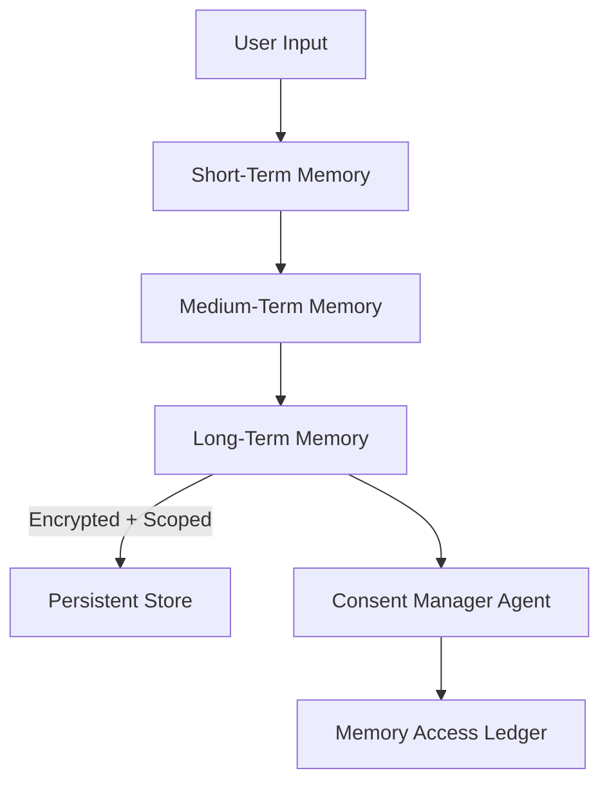
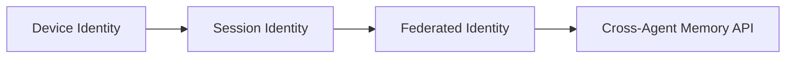

# 217: User-Agent Memory Architecture – Context Handling, Identity Persistence & Data Boundaries

---

## Overview

This document defines the architecture, standards, and mechanisms used to manage memory, identity, and context between users and agents across the `kAI` (kindAI) and `kOS` (kindOS) systems. The goals are:

- Long-term identity and context persistence
- Adaptive memory based on user preferences and security class
- Namespace management across services and devices
- Cross-agent context synchronization with user consent

---

## 1. Memory Types

### 1.1 Short-Term Memory (STM)
- Lives within a single session or process.
- Cleared on session timeout or manual purge.
- Used for:
  - In-progress conversations
  - Volatile task execution
  - Local state transitions (e.g., UI)

### 1.2 Medium-Term Memory (MTM)
- Persists for the duration of a day or temporary user flow.
- Uses local secure disk + encrypted indexed DB.
- Applied for:
  - Form autofill
  - Daily task planning
  - Context switching between views

### 1.3 Long-Term Memory (LTM)
- Cross-session, cross-device storage.
- Encrypted vault with namespace scoping.
- Applications:
  - Relationship models
  - Multi-agent collaboration memory
  - Preferences & identity profiles

---

## 2. Memory Store Implementation

| Memory Type | Backend | Encryption | Expiry         | Example Use Case                      |
|-------------|---------|------------|----------------|---------------------------------------|
| STM         | RAM     | N/A        | On tab/process close | Conversational state          |
| MTM         | IndexedDB | AES-256 | 24h / session end | UI state caching, short plans   |
| LTM         | SQLite + Encrypted Volume | AES-256-GCM + PBKDF2 | Never (user-purge only) | Knowledge retention, preferences |

---

## 3. Identity Architecture

### 3.1 Identity Graph

Each user has a dynamic identity graph made of:
- UUID (universal ID)
- Self-described profile nodes (name, pronouns, location, age, etc.)
- Trust tier scores (for delegation)
- Service-specific credentials (scoped to device and app)
- Consent audit logs (verifiable via `kLP`)

### 3.2 Identity Sharing Layers

| Layer      | Scope         | Consent Needed | Transport Protocol |
|------------|---------------|----------------|---------------------|
| Private    | Device only   | No             | Local FS            |
| Session    | App context   | Yes (UI prompt)| Socket / WebRTC     |
| Federated  | Multiple apps| Yes (verified) | `kLP` / gRPC        |


---

## 4. Namespacing & Boundaries

### 4.1 Namespace Format
```
user.{uuid}.agent.{agent_id}.memory.{type}.{scope}
```

### 4.2 Examples
- `user.89e3.agent.chat.memory.ltm.personal`
- `user.12df.agent.scheduler.memory.mtm.project123`
- `user.777a.agent.profile.memory.ltm.shared`

### 4.3 Cross-Agent Access Rules
- Must declare `intent` with context type
- Require memory-binding scope tags
- Consent token from user (JWT-style signed grant)
- Logged via immutable consent ledger (kLP)

---

## 5. Data Governance & Control

### 5.1 Consent Manager Agent (kAI-consent)
- UI for reviewing, revoking, and granting memory access
- Allows tagging memories as:
  - `ephemeral` (auto-purged)
  - `reviewed` (marked by user)
  - `sealed` (requires pin or biometric)

### 5.2 Purge & Redaction Tools
- One-click wipe per memory type
- Targeted record deletion by namespace
- Cross-device propagation of delete events
- Self-destruct options on trigger (e.g., inactivity, exit)

### 5.3 Transfer & Export Tools
- Full export in encrypted JSON or Protobuf
- Hash-verified snapshots
- Import to compatible kOS environments
- Manual or automated sync

---

## 6. Advanced Topics

### 6.1 Context Cloning
- Snapshot of session state and short/medium memory
- Use case: deploy a duplicate agent for specific project
- Signed provenance to track clone origin

### 6.2 Dynamic Memory Compression
- Periodic summarization using local LLM agent
- Triggered by low storage or inactivity
- Keeps relevant embeddings, discards noise

### 6.3 Trust-Level Based Recall
- Agents can only recall memory up to their trust score
- Example:
  - Trust Level 1: Task memory only
  - Trust Level 3: Profile, habits, sensitive data

---

## 7. Diagrams

### 7.1 Memory Flow (Mermaid)


### 7.2 Identity Sharing Scope


---

## 8. Component Interfaces

### 8.1 `/memory/read`
- Params: `namespace`, `agent_id`, `trust_level`
- Returns: structured memory tree (JSON)

### 8.2 `/memory/write`
- Params: `data`, `intent`, `namespace`, `ttl`, `tags[]`
- Returns: memory receipt (hash, timestamp, storage node)

### 8.3 `/memory/consent`
- Initiates a request for scoped memory access
- UI confirmation sent to user

---

## 9. Future Features

- Zero-knowledge memory segments (user-visible only)
- Peer-to-peer encrypted memory sync across user devices
- Quantum-resistant encryption upgrades

---

## Changelog
- 2025-06-20: Initial version created by system architect (AI agent)

