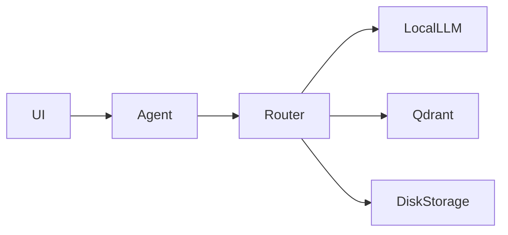
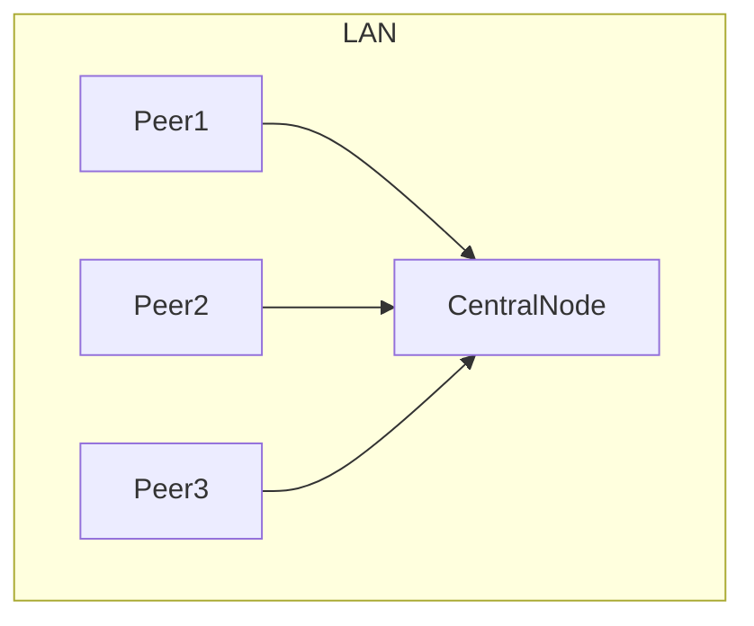
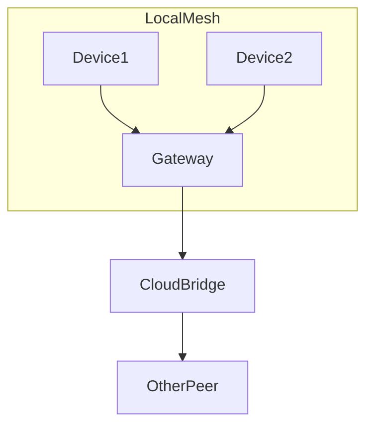

# 21: kAI Network Topology and Deployment Modes

This document defines the full technical topology, networking architecture, and deployment configurations for both standalone and integrated deployments of the Kind AI (kAI) system and the Kind OS (kOS) ecosystem. It covers all tiers: personal, peer-to-peer, LAN, WAN, hybrid mesh, and optional blockchain consensus layers.

---

## I. Network Design Goals

- **Privacy-first**: Default local-first with no data exfiltration
- **Resilience**: Supports offline-first, intermittently connected, and peer-synced operation
- **Modularity**: Interchangeable protocols and services
- **Evolvable**: Layered design for extending or upgrading network protocols
- **Multi-modal Comms**: Internet, LoRa, BLE, Wi-Fi Direct, Ethernet, Cellular

---

## II. Modes of Operation

### A. Standalone Mode (Personal Edge Device)

- All services self-hosted
- Local UI (e.g., via kAI-CD frontend)
- Local LLM and vector DB (e.g., Ollama, Qdrant)
- No external sync

### B. P2P (Peer Mesh)

- Uses Reticulum or libp2p for encrypted peer connections
- Propagates selected memory/state/updates across trusted peers
- Can form mini-clusters for federation

### C. LAN Mode

- Central node for cache, config, secrets
- Agents can roam and re-sync to new LAN nodes
- DNS-SD (Bonjour/mDNS) for discovery

### D. Hybrid Mesh Mode

- LoRa + IP bridging via gateways
- Edge agents sync with mesh node via serial or MQTT
- Multi-hop routing and trust-level scoring

### E. Cloud-Bridge Mode (Optional)

- Public or private VPS acts as rendezvous or backup
- Fully encrypted sync using KLP (Kind Link Protocol)
- Does not require persistent connection

### F. Blockchain/Consensus (Optional)

- IPFS for data distribution
- Local consensus via Raft or Tendermint
- Incentive-based sync for knowledge, updates, models

---

## III. Protocol Stack

```text
App Layer:     kAI Agent ↔ Router ↔ WebUI / API / CLI
Routing:       KLP, Reticulum, libp2p, IPFS
Transport:     TCP, UDP, BLE, Wi-Fi, LoRa, MQTT, HTTP(S)
Security:      Noise Protocol, WireGuard, Tor (optional), TLS
Storage:       Local + S3-compatible for sync
Persistence:   Git, IPFS, Dat, SQL + Vector DB

Special:       Raft/Tendermint for consensus if enabled
```

---

## IV. Core Services

| Component        | Description                                                  |
| ---------------- | ------------------------------------------------------------ |
| `klp-daemon`     | Handles Kind Link Protocol traffic, auth, encryption         |
| `peer-index`     | Manages trusted peers, discovery, scoring                    |
| `sync-engine`    | Handles delta compression, transmission, conflict resolution |
| `bridge-service` | Optional relay, NAT-bypass node                              |
| `event-bus`      | Broadcast + event-routing layer between agents               |
| `auth-guardian`  | Public/private key auth, permission management               |
| `kAI-router`     | Traffic control, fallback logic, proxy mode                  |

---

## V. Deployment Topologies

### A. Personal Device



### B. Trusted LAN Mesh



### C. Global Hybrid Mesh



---

## VI. Security Layers

- **Device Identity**: ed25519 keypair per device
- **Peer Auth**: KLP + challenge-response handshake
- **Encrypted Tunnels**: WireGuard or TLS 1.3
- **Data Isolation**: Namespace-based storage partitions
- **Role-Based Access Control**: Configurable for every service

---

## VII. Performance & Redundancy

- Opportunistic compression + caching
- Delta-sync with conflict resolution
- Intelligent fallback (local > LAN > P2P > cloud)
- Watchdog for stuck state or broken links

---

## VIII. Monitoring & Logs

- Real-time state dashboard (CLI + UI)
- Distributed logs: local only by default
- Option to ship anonymized stats (disabled by default)
- All network events audit-logged with time and signature

---

## IX. Future Enhancements

| Feature                        | Target Version |
| ------------------------------ | -------------- |
| Multi-hop trust propagation    | v1.1           |
| Zero-trust enclave sync        | v1.2           |
| Self-healing topology          | v1.3           |
| Passive peer discovery via SDR | v2.0           |

---

### Changelog

- 2025-06-21: Initial complete topology document with low-level implementation detail

