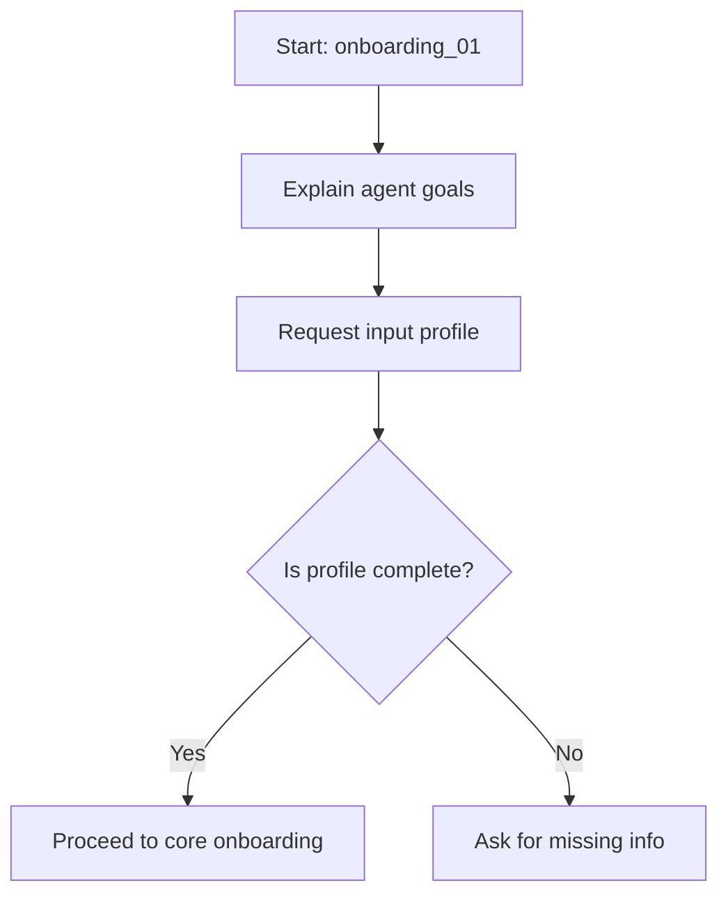

# 221: Prompt Management System – Categorization, Embedding, Linking, Versioning, Usage Metrics

---

## Overview

The Prompt Management System (PMS) in kAI/kOS is responsible for handling all prompts used across LLM interfaces, agent interactions, workflows, tutorials, security, and instructional content. The system allows for structured storage, linking, classification, historical tracking, and performance analysis of prompts.

---

## Directory Structure

```plaintext
/core
  /prompt_manager
    prompt_store.py              # Core logic for storing and retrieving prompts
    prompt_embedder.py           # Generates and caches vector embeddings
    prompt_linker.py             # Manages contextual and semantic links between prompts
    prompt_versioning.py         # Tracks revisions and maintains version history
    prompt_metrics.py            # Tracks usage statistics and performance metadata
    __init__.py

/config
  prompts.yaml                   # Default prompt categories and configuration options
  prompt_permissions.yaml        # Role-based access to prompts

/data/prompts
  /categories
    general/
    onboarding/
    security/
    troubleshooting/
    tutorials/
  /linked
    ... (files with multi-prompt workflows and linked chain logic)
  /versions
    ... (versioned history of key prompt chains)
  /archived
    ... (inactive or deprecated prompts)

/ui
  /components
    PromptEditor.vue             # Interface to edit and test prompts
    PromptList.vue               # UI to browse and search all prompts
    PromptHistory.vue            # Version control viewer
    PromptGraph.vue              # Interactive linked prompt map (mermaid-based)

/api
  /routes
    prompt_routes.py             # RESTful endpoints for prompt operations
```

---

## Features & Components

### 🗂 Prompt Categorization
- YAML and tag-based classification
- Filters by:
  - Agent type
  - Capability (e.g. reasoning, classification, RAG)
  - Task context (e.g. onboarding, devops, therapy)
  - Language and tone

### 🧠 Embedding & Similarity Search
- Embedding model: `text-embedding-3-small` or custom MiniLM
- Vector DB: Qdrant or Chroma
- Fast approximate similarity for prompt reuse, debugging, clustering

### 🔗 Prompt Linking & Chaining
- Mermaid graphs and metadata headers:
  ```yaml
  links:
    - id: onboarding_01
      type: sequence
    - id: security_check
      type: fork
  ```
- Internal resolver maps flows automatically
- Can be exported as DOT or Mermaid for agent consumption

### 📜 Prompt Versioning
- Uses `prompt_id@version` scheme
- `diff-prompts` tool shows changes over time
- Can rollback to previous versions
- Git-style metadata:
  - Author
  - Timestamp
  - Summary

### 📈 Prompt Usage Metrics
- Tracked fields:
  - `invocation_count`
  - `agent_success_rate`
  - `user_feedback_score`
  - `modification_count`
- Useful for auto-curation, optimization, and user studies

---

## REST API Endpoints

| Method | Endpoint                 | Description                       |
|--------|--------------------------|-----------------------------------|
| GET    | /prompts                 | List all prompts                  |
| GET    | /prompts/{id}           | Get specific prompt by ID         |
| GET    | /prompts/{id}/versions  | List all versions of a prompt     |
| POST   | /prompts                | Add a new prompt                  |
| PUT    | /prompts/{id}           | Update a prompt                   |
| DELETE | /prompts/{id}           | Archive prompt                    |

---

## Security & Governance
- Prompts can be encrypted for security workflows
- Role-based access via `prompt_permissions.yaml`
- Some prompts (e.g., onboarding, KLP links) are protected from edits

---

## Visuals

### Mermaid: Prompt Workflow Chain Example


---

## Planned Future Features
- Prompt A/B Testing system
- Reinforcement Learning from Prompt Outcomes (RLPO)
- Auto-Refinement Agents (ARA) for prompt generation/optimization
- Prompt Linting Ruleset
- Export to LangChain templates and OpenPrompt DSL

---

## Changelog
- 2025-06-20: Initial version (AI agent)

