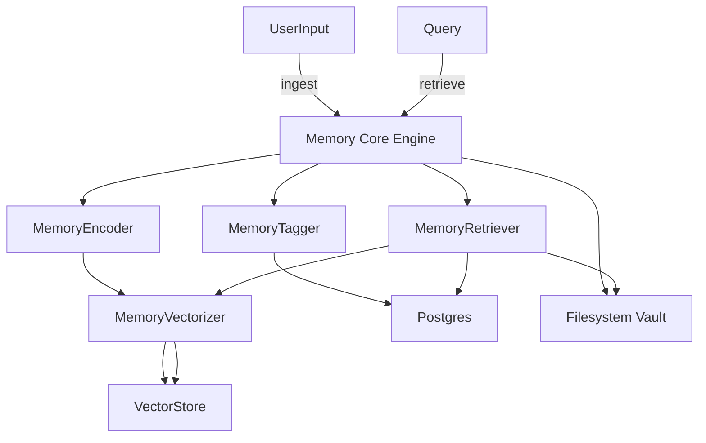

# 222: Agent-LLM Memory Protocols – Temporary, Episodic, Semantic, Long-Term Store Integration

## Overview
This document defines the complete memory architecture for agents within the kAI/kOS ecosystem. It outlines the structure, protocols, storage, retrieval strategies, and integration requirements for multi-modal, multi-agent memory systems across various time scales.

---

## Memory Types & Purposes

| Type             | Purpose                                              | Lifetime      | Storage Location             |
|------------------|------------------------------------------------------|---------------|------------------------------|
| Short-Term       | Temporary recall within a session                   | Minutes-Hours | RAM / Session Cache          |
| Episodic         | Narrative events, timelines, user interactions      | Hours-Days    | Local DB + Vector DB         |
| Semantic         | Conceptual, symbolic, generalized knowledge         | Long-term     | Vector DB (Qdrant/Chroma)    |
| Long-Term Store  | Structured history, documents, permanent notes      | Persistent    | PostgreSQL + Filesystem      |
| Personalization  | User config, tone, preferences                      | Persistent    | Local Indexed DB             |
| External Memory  | Connected devices, APIs, external DBs               | Varies        | Indexed by URI + Credential  |

---

## Memory Architecture Layers

### 🧠 Memory Core Engine (MCE)
- Pluggable interface supporting different memory strategies.
- Manages lifecycle: ingest → encode → tag → store → retrieve → decay/refresh.
- Modules:
  - `MemoryEncoder`
  - `MemoryTagger`
  - `MemoryVectorizer`
  - `MemoryRouter`
  - `MemoryRetainer`
  - `MemoryCleaner`

### 🧬 Memory Encoding Formats
- Supported input formats:
  - Text, Markdown, HTML, JSON
  - Audio (transcribed)
  - Video (frames + transcript)
  - Structured Data (tables, CSV)
- Encoded formats:
  - Dense Embeddings (OpenAI, BGE, Instructor, E5)
  - Tagged metadata (timestamp, type, role, session, importance, source)

---

## Storage Backends & Indexing

### 🔍 Vector Memory Store
- Engines: Qdrant, Chroma, Weaviate (local/cloud)
- Schema:
  ```json
  {
    "embedding": [0.02, -0.13, ...],
    "type": "semantic/episodic",
    "tags": ["chat", "finance", "user:john"],
    "source_id": "kai-msg-042",
    "timestamp": 1718958323,
    "importance": 0.81,
    "data": {
      "text": "User asked about investing in solar startups"
    }
  }
  ```

### 🗃️ Relational Store
- PostgreSQL or SQLite for long-term structured memory:
  - Sessions
  - Conversations
  - Task outcomes
  - Identity/personality snapshots
  - File associations
  - Linked credential references

### 📂 Filesystem Storage
- Local vaults for:
  - Large documents
  - Media files (voice, video, images)
  - Audit logs
  - Memory snapshots (as serialized JSON/CSV)

---

## Retrieval Strategies

### 1. Temporal Retrieval
- Pull last N memories (chronological)
- Used for context window stitching

### 2. Semantic Retrieval
- Vector similarity search + reranking (BM25 + hybrid)
- Prompt use:
  - Retrieve Top K matches
  - Tag-based filtering
  - Dynamic embedding models per agent

### 3. Episodic Narrative Threading
- Fetch prior task chains or storylines
- Timeline reconstruction for RAG agents

### 4. User-Tuned Context Windows
- Sliding memory window
- Session replay configuration:
  - Full replay
  - Summary mode
  - Smart highlights

---

## Integration: Agent-Oriented Access

### Access APIs
```ts
POST /memory/query
{
  "agent_id": "kai_home_assistant",
  "query": "How did user react to the daily briefing yesterday?",
  "types": ["episodic", "semantic"],
  "filters": {
    "tags": ["user:john"],
    "importance": ">0.5"
  },
  "limit": 10
}
```

### Ingestion APIs
```ts
POST /memory/store
{
  "agent_id": "kai_nutritionist",
  "data": {
    "text": "User said they skipped breakfast and had a headache",
    "type": "episodic",
    "importance": 0.7,
    "tags": ["health", "breakfast", "user:john"]
  }
}
```

---

## Prompt-Time Usage
- Inject summary or embedding hits into LLM prompts
- Auto-generated memory prepended:
```txt
Previous user context:
- Skipped breakfast
- Mentioned headaches recently
- Likes oat milk lattes

Current prompt:
How are you feeling this morning?
```

---

## Agent Memory Configuration

| Setting                  | Description                              | Default |
|--------------------------|------------------------------------------|---------|
| `memory.enabled`         | Toggle memory per agent                  | true    |
| `memory.window`          | How much short-term memory to preload    | 5 msgs  |
| `memory.types`           | Which stores to use (vector, sql, file)  | all     |
| `memory.retention_days`  | Purge threshold for episodic memory      | 14      |
| `embedding.model`        | Model for vectorization                  | BGE-Large |

---

## Governance & Privacy
- Users can:
  - View their memory records (via Memory Manager UI)
  - Delete, redact, or export memory
  - Mark memories as private/undeletable/critical
- Agents must:
  - Respect memory governance rules
  - Include tags/metadata for traceability

---

## Diagram – Memory Architecture


---

## Dependencies
- `sentence-transformers`
- `chromadb`, `qdrant-client`, `weaviate-client`
- `sqlalchemy`, `asyncpg`
- `langchain.memory` (optional adapter layer)
- `pydantic`, `fastapi`
- `kai-core.memory` module

---

## Related Docs
- `223_Context_Window_Mgmt.md`
- `224_Prompt_Embedding_Policies.md`
- `111_Architecture_Core_Modules.md`

