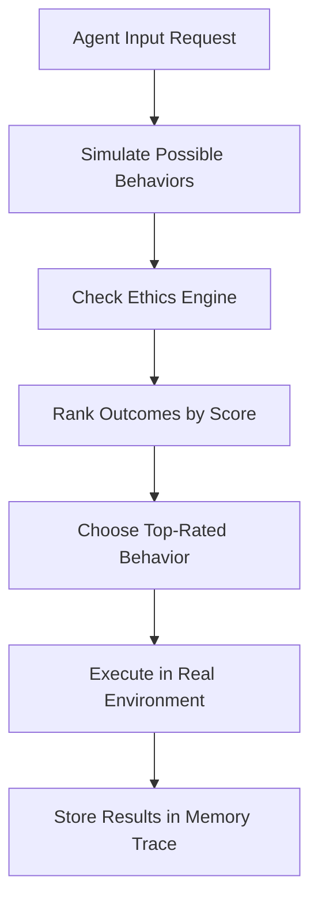

# 224: Agent Simulation Core – Behavior Models, Internal Environments, Reflexive AI Design

---

## Overview

This document outlines the design and implementation of the Agent Simulation Core (ASC) within the `kAI` ecosystem. The ASC enables sandboxed agent self-reflection, planning, testing, and simulation of hypothetical behaviors within controlled virtual environments. This capability forms the backbone for emergent, adaptive, self-improving AI behavior within a decentralized but accountable framework.

---

## Goals

- Enable agents to run sandbox simulations of planned behaviors and decisions
- Provide tooling for behavioral testing, validation, and ethical flagging
- Allow reflexive learning through simulated consequences
- Define runtime virtual environments for behavioral exploration
- Enable developers to simulate interactions across networks of agents (multi-agent sim)

---

## Directory Structure

```text
/core/agent_simulation/
├── environments/
│   ├── schema.ts              # Runtime schema for environments
│   ├── local_env.ts           # Offline sandbox environments
│   ├── networked_env.ts       # Online/multi-agent simulation handler
│   └── ethics_engine.ts       # Constraint/flagging system
├── behavior_models/
│   ├── memory_trace.ts        # Tracks behavior histories
│   ├── decision_engine.ts     # Decision model sim executor
│   ├── causal_graphs.ts       # Cause/effect tracking
│   └── behavior_reflection.ts # Self-critique + iteration engine
├── sim_runner.ts              # Main simulation execution engine
├── sim_config.yaml            # Global config and runtime toggles
├── metrics.ts                 # Result scoring and trace evaluation
└── README.md
```

---

## Key Concepts

### 🔁 Reflexive Simulation
- Agents simulate actions, observe simulated outcomes, then alter behavior.
- Sim cycles use prior memories, causal graphs, feedback traces.

### 🧠 Behavior Models
- Models store behavioral traits, constraints, reinforcement scores.
- Agents accumulate a trace of actions and evaluations for review.

### 🌐 Multi-Agent Simulation
- Enables stress-testing emergent coordination between agents.
- Supports adversarial, collaborative, and neutral-agent scenarios.

### 🛡️ Ethics Engine
- Runs during all simulations.
- Flags behaviors that violate soft or hard ethical constraints.
- Configurable for different environments (e.g., research, healthcare).

### 🧮 Simulation Output
- Simulation traces output:
  - Outcome state
  - Causal logs
  - Constraint violations
  - Behavior rating score

---

## Example Use Case: Reflexive Planning



---

## Configuration: `sim_config.yaml`

```yaml
enabled: true
max_sim_depth: 3
ethics:
  enabled: true
  soft_flags: ["emotional harm", "unverified claims"]
  hard_blocks: ["violence", "privacy breach"]
logging:
  traces: true
  violations: true
  decision_graphs: true
temp_sandbox_env: "local_env"
```

---

## Integration with Other Modules

- `memory/trace_engine.ts`: Supplies past behavior logs
- `llm/agent_orchestrator.ts`: Schedules and controls sim runs
- `security/ethics_engine.ts`: Shared core with live ethics checker
- `metrics/reputation_score.ts`: Simulation results affect agent reputation

---

## Future Features

- Visualizer UI for live sim debugging
- Agent-style export of simulation history
- Plug-in support for environment types (e.g., economic, linguistic, physical)

---

## License & Attribution

This simulation engine is part of the open `kAI` ecosystem and is governed by the Kind License. Please see the global `LICENSE.md` for redistribution and governance policies.

