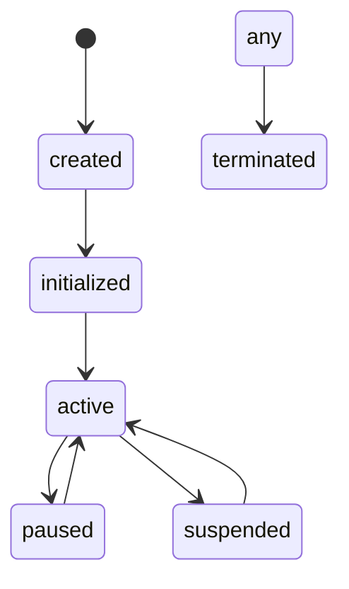

# 23: kAI Agent Lifecycle and Execution Model

This document outlines the lifecycle, behavioral model, and operational modes of kAI agents. It defines how agents are created, initialized, updated, persisted, paused, resumed, and terminated across local, remote, and hybrid deployments.

---

## I. Purpose

To define a predictable, robust, and extensible lifecycle model for all agents operating under Kind AI (kAI) and Kind OS (kOS), ensuring consistent behavior, control, and introspection.

---

## II. Lifecycle States

Each agent exists in one of the following states:

| State         | Description                                       |
| ------------- | ------------------------------------------------- |
| `created`     | Agent object instantiated but not yet running     |
| `initialized` | Configuration and context loaded                  |
| `active`      | Actively executing tasks or responding to events  |
| `paused`      | Temporarily inactive but memory/context retained  |
| `suspended`   | Offloaded from memory but can be rehydrated       |
| `terminated`  | Fully shut down and archived (optionally deleted) |

---

## III. Lifecycle Transitions



---

## IV. Directory Structure

```text
src/agents/
├── core/
│   ├── AgentManager.ts         # Manages all agent lifecycle state
│   ├── AgentRegistry.ts        # Central lookup and UUID management
│   └── AgentExecutor.ts        # Manages task queues, concurrency, retries
├── models/
│   └── Agent.ts                # Class definition for agents
├── state/
│   ├── AgentStore.ts           # Zustand/Jotai state persistence
│   └── SessionPersistence.ts   # LocalStorage/indexedDB snapshot logic
└── protocols/
    └── LifecycleProtocol.ts    # KLP-compliant lifecycle operations
```

---

## V. Lifecycle Control API

### A. AgentManager Methods

```ts
createAgent(agentConfig: AgentConfig): AgentInstance
initializeAgent(id: UUID): void
startAgent(id: UUID): void
pauseAgent(id: UUID): void
resumeAgent(id: UUID): void
suspendAgent(id: UUID): void
terminateAgent(id: UUID): void
```

### B. External Commands via KLP

```json
{
  "op": "agent.control",
  "action": "pause",
  "target": "agent:planner:42"
}
```

---

## VI. Execution Model

### A. Modes of Execution

- **Foreground:** Immediate processing (e.g. UI agent interaction)
- **Scheduled:** Triggered at intervals or calendar events
- **Event-Driven:** React to triggers or signal buses
- **Chained:** Called as part of a task graph (via planner, AutoGen, CrewAI, etc.)

### B. Concurrency Model

- Task queue per agent instance
- Bounded parallelism (e.g. 2 threads max per agent)
- Retry/backoff policy per capability
- Logged task provenance

### C. Resource Constraints

- CPU/memory quotas per agent (in config)
- Optional sandboxing with `nsjail`, Web Workers, or Docker

---

## VII. Persistence and Resilience

### A. Session Snapshots

- Stored via `SessionPersistence.ts`
- Encrypted snapshots of full agent state
- Triggered on pause, suspension, or browser unload

### B. Rehydration

- On resume, loads context from last snapshot
- Restores memory, persona, capabilities, last task pointer

### C. Crash Recovery

- Auto-restart on exception (configurable max retries)
- Error logs saved to `/logs/errors/*.json`
- Alerting agent can notify user/admin

---

## VIII. Event Hooks

Hooks for developers and integrators:

```ts
onAgentCreated(agentId)
onAgentStarted(agentId)
onAgentPaused(agentId)
onAgentCrashed(agentId, error)
onAgentResumed(agentId)
```

---

## IX. UI Representation (kAI-CD)

- State badge shown on agent cards (color coded)
- Pause/Resume/Terminate buttons on UI
- State transitions logged in audit timeline
- Developer console for active stack trace & last result

---

## X. Future Enhancements

| Feature                    | Target Version |
| -------------------------- | -------------- |
| Live Migration (kOS cloud) | v1.4           |
| State Diff Viewer          | v1.3           |
| Parallel Execution Graphs  | v2.0           |
| kNode Mesh Sync            | v2.2           |

---

### Changelog

- 2025-06-20: Initial version with full state model, executor, API design.

