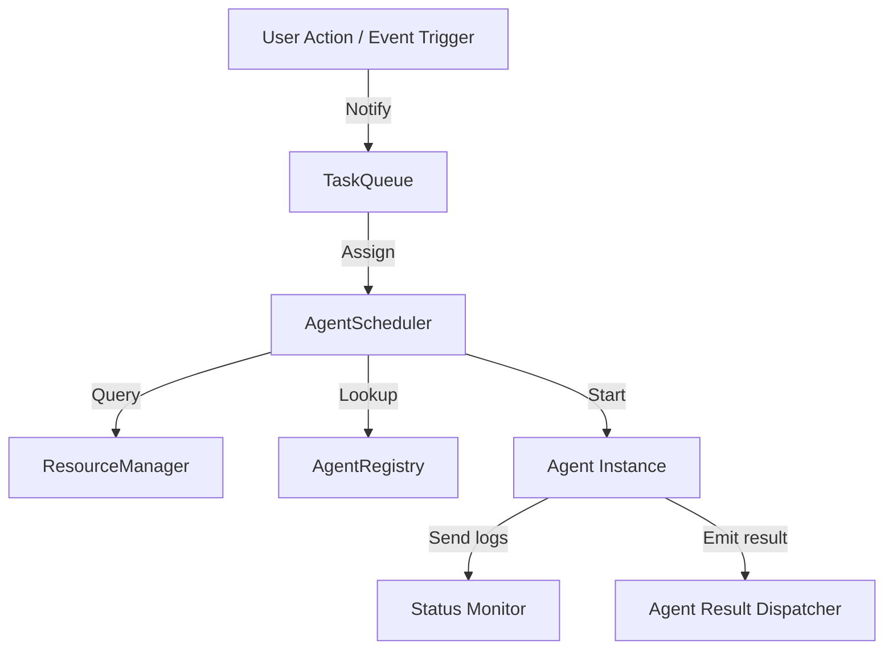

# 249: Agent Deployment Scheduler (kOS)

## Overview

The Agent Deployment Scheduler is a core subsystem in kOS responsible for managing the execution timelines, priorities, dependencies, and resource availability of both ephemeral and persistent AI agents across all connected devices and nodes. It acts as a brainstem-level orchestrator, ensuring efficient execution and coordination of services with minimal latency and maximal parallelism.

---

## Purpose

- Orchestrate AI agent launches and life cycles
- Respect user/system-configured schedules, availability, and task queues
- Ensure proper resource allocation (RAM, GPU, bandwidth)
- Handle agent dependencies and intercommunication
- Provide observability into agent lifespans and performance metrics

---

## Key Concepts

### Agent Schedules

- **On-Demand:** Spawned in real time when prompted by a trigger (voice, API, event)
- **Recurring:** Based on CRON, solar, or user-defined schedules
- **Conditional:** Spawned in reaction to sensor data or external inputs

### Priority Queuing

- **Priority Levels:** Critical, High, Medium, Low, Background
- **Preemption Rules:** Higher-priority tasks can suspend or reallocate resources from lower-priority agents

### Agent Types

- **Persistent Agents:** Always running, responsible for monitoring or critical roles (e.g., health monitor)
- **Ephemeral Agents:** Spawned for a single task, then destroyed
- **Cascading Agents:** Trigger other agents (e.g., kAI frontend prompts backend reasoning agent)

---

## Components

### 1. `agent_scheduler.py`

- Central controller managing registration, scheduling, execution, and shutdown
- Uses asyncio event loop for concurrent task handling
- Integrates with `resource_manager.py`, `task_queue.py`, and `agent_registry.py`

### 2. `task_queue.py`

- Task-based scheduling with FIFO, LIFO, priority heap, and dependency graph modes
- Supports CRON syntax and human-readable rules

### 3. `agent_registry.py`

- Maintains metadata about all available agents:
  - Capabilities
  - Execution environments (Docker, systemd, subprocess, sandbox)
  - Startup requirements
  - Communication ports/interfaces

### 4. `resource_manager.py`

- Monitors available system resources:
  - RAM, CPU, GPU, network I/O
  - Battery level for mobile devices
- Dynamically rebalances agent execution according to availability

### 5. `agent_status_monitor.py`

- Live dashboard of all agent states: running, sleeping, crashed, rebooting
- Publishes WebSocket events to frontend UI
- Logs lifecycle events to Prometheus + Loki

### 6. `agent_lifecycle_hooks.py`

- Pre-start, post-start, and on-shutdown hooks for:
  - Data preload
  - Model warm-up
  - Result dispatch
  - Archive output or logs

---

## Data Flow



---

## Config File: `scheduler_config.yaml`

```yaml
max_concurrent_agents: 12
scheduler_mode: priority
heartbeat_interval: 5  # seconds
allow_agent_preemption: true
max_memory_usage: 85%  # system-wide limit
log_retention_days: 30
agent_timeout_default: 600  # seconds
reschedule_on_crash: true
```

---

## Sample Agent Registration

```json
{
  "agent_id": "prompt_optimizer",
  "capabilities": ["prompt_analysis", "optimization"],
  "exec_env": "docker",
  "entry_point": "/app/start.sh",
  "priority": "high",
  "tags": ["llm", "nlp"],
  "cpu": 2,
  "gpu": 1,
  "memory": "4GB"
}
```

---

## Logging & Metrics

- **Logs:** JSON structured logs per agent instance with UID
- **Metrics:**
  - Agent start/stop duration
  - Resource consumption
  - Crashes & restarts
  - Task throughput

Backend: Prometheus + Grafana + Loki stack

---

## User Interface: `AgentScheduleView`

- Calendar-based task view
- Drag-and-drop task rescheduling
- Live agent activity overlay
- Manual start/stop buttons

---

## Future Additions

- **Federated Scheduling:** Share agent load across mesh or cloud-connected peers
- **Adaptive AI Scheduler:** Use RL to optimize agent execution patterns
- **Predictive Agent Readiness:** Warm up agents preemptively based on user behavior models
- **Intent Graph Integration:** Schedule agents based on inferred high-level goals

---

## Dependencies

- Python 3.11+
- FastAPI (admin endpoints)
- Redis (task queue)
- Docker SDK
- psutil
- pyyaml
- Prometheus client

---

## Security Considerations

- Agents launched in sandboxed environments (Docker/nsjail)
- System resource caps per agent to prevent denial of service
- JWT-based agent spawn authorization
- Logged & auditable task trails

---

## File Tree

```
core/
  scheduler/
    agent_scheduler.py
    agent_registry.py
    agent_status_monitor.py
    agent_lifecycle_hooks.py
    resource_manager.py
    task_queue.py
    scheduler_config.yaml
```

---

## Status

🟩 Draft Complete 🟨 Pending integration with `intent_engine` ⬜ Security audit scheduled for Phase 3

---

## Next Document:

**250 – Agent Result Dispatcher (kOS)**

