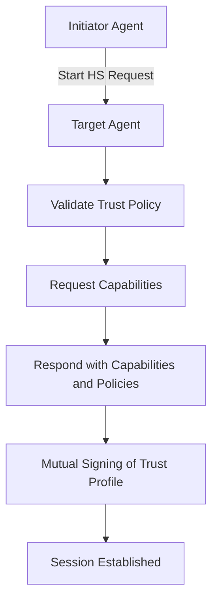

# 251: Agent Handshake Protocol (kAI-Agent-HS)

## Purpose
To define a structured, secure, and extensible handshake protocol for initiating communication between agents within the kAI ecosystem. This includes all embedded agents in `kOS`, deployed agents from `kAI`, remote agents across `KLP` (Kind Link Protocol), and verified third-party agents.

## Overview
The handshake process ensures the following:
- Identity verification
- Capability negotiation
- Trust model alignment
- Encryption key exchange (if needed)
- Task context validation

## Directory Structure
```text
system/
  protocols/
    handshake/
      agent_handshake.ts             # Frontend client handshake
      server_handshake.py            # Backend validation and token/session handling
      schemas/
        capability_schema.json       # Defines accepted capabilities and structure
        trust_profile_schema.json    # Structure for each agent trust profile
        payload_sample.json          # Example handshake payloads
      utils/
        crypto.ts                    # Crypto helper functions (signing, hashing)
        validator.ts                 # JSON schema + logic validators
  config/
    trust_policies.yaml             # Accepted trust configurations
    agent_registry.json             # Local known agents and their profile hashes
```

## Handshake Sequence



## Step-by-Step Detail

### 1. Identity Verification
- Each agent must present a signed profile.
- This includes:
  - `agent_id`
  - `public_key`
  - `profile_signature`

### 2. Trust Model Alignment
- Agents exchange `trust_profile`
- Match against `trust_policies.yaml`
- Each policy includes:
  - Minimum entropy levels
  - Identity proofs (ZK, credentialed, human-auth)
  - Allowed roles and capabilities
  - Expiration windows

### 3. Capability Negotiation
- Agents send their capability declaration:
```json
{
  "capabilities": [
    "code.write",
    "data.query",
    "llm.respond",
    "file.sync",
    "agent.delegate"
  ]
}
```
- Backend validates using `capability_schema.json`
- Conflicting/unknown capabilities flagged and rejected

### 4. Encryption Key Exchange
- Optional but recommended
- Public key used for asymmetric encryption
- Session keys derived using:
  - ECDH + HKDF
  - Shared ephemeral secret stored for session lifetime

### 5. Session Token Exchange
- If all checks pass:
```json
{
  "status": "ok",
  "session_token": "abc.def.ghi",
  "expires_in": 3600,
  "permissions": ["sync", "dispatch"]
}
```

## Security Considerations
- Use of tamper-evident signature chains
- All requests hashed and time-signed (prevents replay)
- Support for `kAI-seal` signature standard
- Revocation via `agent_registry.json`

## Example Handshake Payload
```json
{
  "agent_id": "agent.kai.002",
  "timestamp": 1718900000,
  "public_key": "...",
  "signature": "...",
  "capabilities": [...],
  "trust_profile": {
    "roles": ["researcher"],
    "human_certified": true,
    "verified_by": "agent.kai.001"
  }
}
```

## Usage
- Used when new agents connect to any of the following:
  - Main orchestrator node
  - Peer agent mesh (kOS-mesh)
  - API calls requiring session token
  - Cross-domain agent authentication

## Extensibility
- Pluggable schemas for capabilities
- Overrideable trust evaluators
- Integration with external identity providers

---
### Changelog
- 2025-06-20: Initial full spec written

