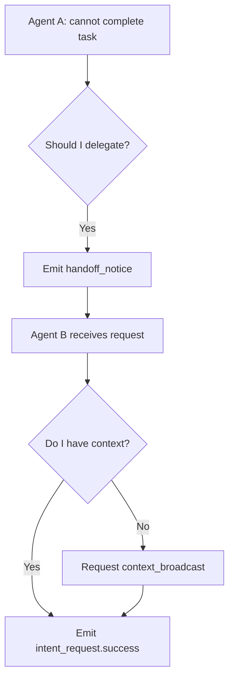

# 254 Agent-to-Agent Interaction Protocol (kAIP)

## Overview

The **kAIP** (kind Agent Interaction Protocol) defines the universal communication and behavioral rules for interaction between any two agents in the kAI ecosystem. It ensures interoperability, shared intent, behavioral alignment, trust management, and real-time contextual responsiveness.

---

## 🌐 Purpose

- Standardize inter-agent messaging, intent propagation, and context sharing.
- Enable dynamic team formation, collaboration, and handoffs.
- Maintain secure, observable, and auditable communication trails.
- Support high-autonomy decision-making with trust and oversight mechanisms.

---

## 🔧 Protocol Stack

### Layer 0: Transport

- **Local Mode**: Shared memory bus, UNIX domain sockets
- **Networked Mode**: WebSocket, gRPC over HTTP/2, MQTT, ZeroMQ

### Layer 1: Message Encoding

- **Format**: JSON or MessagePack
- **Schema**: Defined by shared `agent_contracts/schema/interaction_event.json`

### Layer 2: Communication Events

Every message is a signed event.

```json
{
  "type": "intent_request",
  "from": "kAI://agent.ui.manager",
  "to": "kAI://agent.scheduler",
  "timestamp": 1719123092,
  "intent": "schedule.task",
  "data": {
    "task": "remind_user",
    "time": "2025-06-23T09:00:00-05:00"
  },
  "signature": "...",
  "trust_token": "..."
}
```

### Layer 3: Interaction Semantics

- `intent_request` — Ask another agent to perform a task
- `status_report` — Inform on current state, capabilities, metrics
- `context_broadcast` — Share situational awareness to team
- `handoff_notice` — Voluntarily delegate a task
- `failure_signal` — Explicit error state, with cause and request for fallback
- `validation_request` — Request confirmation or oversight
- `consensus_vote` — Participate in consensus formation

---

## 🔐 Trust and Verification

### Trust Model

- **Trust Score**: Assigned to each agent via `trust_registry.json`
- **Trust Tokens**: Time-limited, task-specific proof of delegation or authority

### Signature System

- Every message must be signed with the agent’s private key
- All agents hold known public keys in a shared `agent_pubkeys.json`

### Audit Trail

- All events are logged in a tamper-proof append-only log (e.g. Merkle tree)
- Log replicated to system controller and optionally encrypted

---

## 🤝 Agent Identity

- URI-Based Format: `kAI://agent.category.name`
- Metadata: Maintained in `agent_registry.yaml`
- Capabilities, trust score, and specialization recorded centrally

---

## ⚙️ Agent Lifecycle Events

- `agent_register`
- `agent_update`
- `agent_suspend`
- `agent_handoff`
- `agent_terminate`

---

## 🔄 Task Handoff Flow (Simplified)



---

## 📄 Agent Manifest Requirements

Each agent must define its:

- Supported intents
- Fallback behavior
- Dependencies
- Trust level required to respond to requests
- Frequency of `status_report`

Stored in: `agents/agent.<name>/manifest.yaml`

---

## 🧠 Future Extensions

- Fuzzy intent matching and negotiation
- Chain-of-intent replay for explainability
- Embedded human-in-the-loop verification nodes
- Federation with external agent protocols (AutoGen, OpenAgents, etc.)

---

## 🔚 Summary

kAIP is the secure connective tissue of the kAI system, designed to make the entire agent ecosystem collaborative, modular, and resilient by design. It balances autonomous functionality with user-aligned guardrails and observability.

