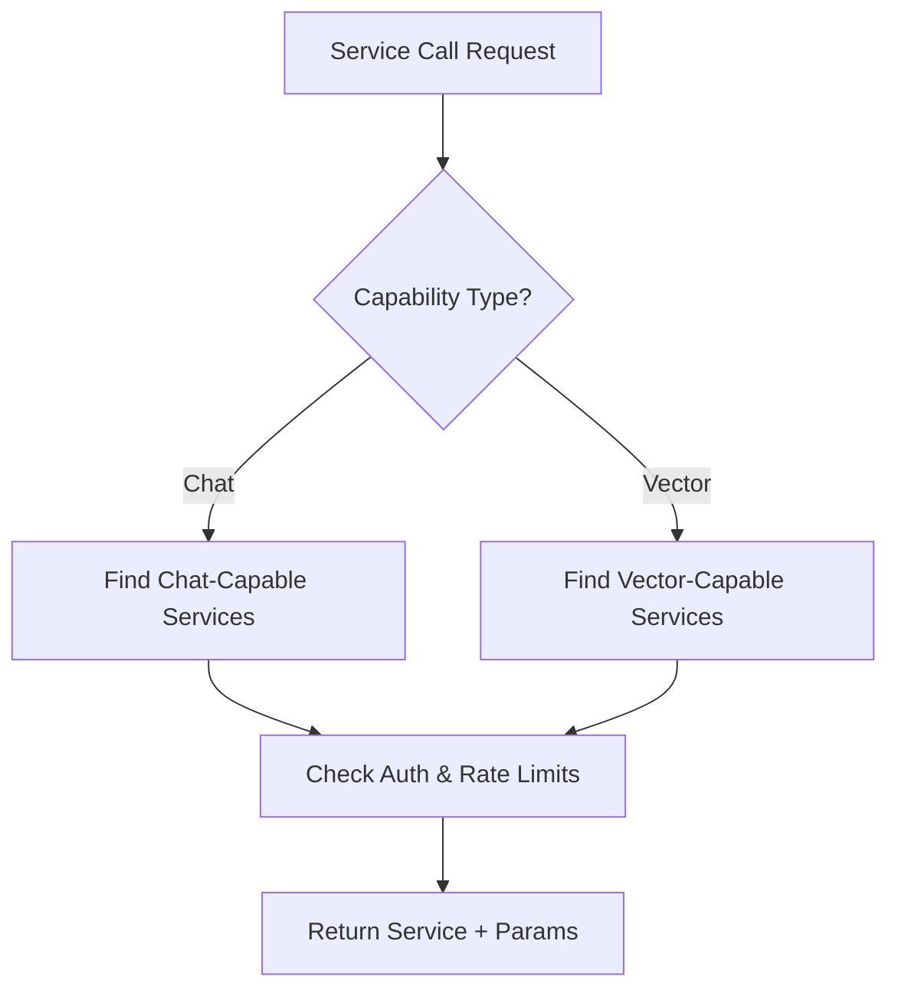
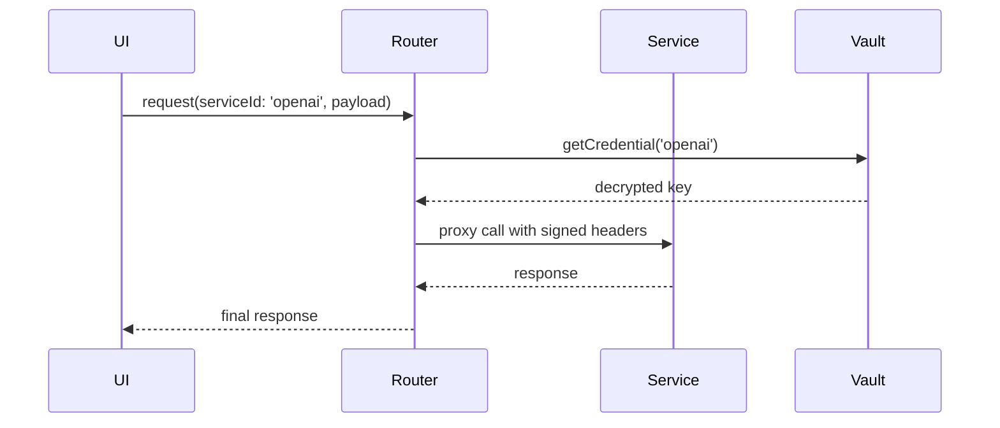

# 32: Service Manager Stack and KindLink Protocol (kLP)

This document specifies the full stack, integration strategies, and protocol specifications for the Kind Service Manager, which handles service registration, routing, secrets, and interaction with the KindLink Protocol (kLP) across kAI and kOS.

---

## I. Purpose

The Service Manager Stack coordinates:
- All local and remote service connectors
- Secure credential vaulting
- API surface normalization
- kLP-based routing and discovery

It ensures that services—whether AI models, vector stores, media generators, or third-party APIs—are modular, interchangeable, and safely routed through the system.

---

## II. Directory Structure

```text
src/
└── services/
    ├── index.ts                        # Entry point for dynamic service loading
    ├── registry/                       # All registered connectors
    │   ├── openai.ts                   # OpenAI service handler
    │   ├── ollama.ts                   # Ollama local runtime
    │   ├── chromadb.ts                 # Chroma DB service
    │   ├── anthropic.ts                # Claude handler
    │   ├── huggingface.ts             # Hugging Face API wrapper
    │   └── ...                         # Other service connectors
    ├── vault/
    │   ├── CredentialManager.ts        # Secure secret interface
    │   └── VaultClient.ts              # Low-level crypto vault client
    ├── dispatcher/
    │   ├── Router.ts                   # Dynamic route resolution (by capability)
    │   └── Middleware.ts               # Middleware hooks for logging, caching, ACL
    └── types/
        ├── ServiceDefinition.ts        # Universal service schema
        ├── CapabilitySchema.ts         # Capability types: chat, gen, vector
        └── AuthSchema.ts               # Auth modes: none, bearer, api_key
```

---

## III. ServiceDefinition Format

```ts
interface ServiceDefinition {
  id: string;                         // Unique ID
  name: string;                       // Display name
  description: string;
  baseUrl: string;
  auth: AuthConfig;
  capabilities: Capability[];        // Chat, Vector, Image, Audio, etc.
  isLocal: boolean;                  // Local runtime or remote
  tags?: string[];                   // For grouping, UI filters
}
```

---

## IV. Capability Types

```ts
// CapabilitySchema.ts
export type Capability = ChatCapability | VectorCapability | ImageGenCapability;

interface ChatCapability {
  type: 'chat';
  endpoints: {
    chat: string;
    models: string;
  };
  parameters: ChatParams[];
}

interface VectorCapability {
  type: 'vector';
  endpoints: {
    query: string;
    insert: string;
    delete: string;
  };
}

interface ImageGenCapability {
  type: 'image_gen';
  endpoint: string;
}
```

---

## V. Credential Security Layer

- All credentials are stored in the Vault module
- Configurable encryption (AES-GCM with PBKDF2)
- Access mediated by `CredentialManager`
- Auto-load for signed-in users or local profile store

```ts
CredentialManager.get('openai'); // Returns decrypted token (if authorized)
```

---

## VI. Router Resolution Flow



---

## VII. kLP Integration (KindLink Protocol)

### A. Role of kLP:
- Service discovery (local or federated)
- Metadata sync
- API contract publication
- Identity and signature registry

### B. Discovery Packet Format

```json
{
  "serviceId": "openai",
  "host": "https://api.openai.com",
  "capabilities": ["chat"],
  "version": "1.2.3",
  "signature": "<ed25519>"
}
```

### C. Publishing
- Services can publish themselves via kLP:
  - `POST /klp/register`
  - Include metadata, fingerprint, signed payload

### D. Verification
- `GET /klp/verify?serviceId=openai`
- Returns:
  - Chain of trust
  - Signature
  - KLP Score (trustworthiness)

---

## VIII. Middleware Extensions

```ts
interface MiddlewareHook {
  onRequest?(req): void;
  onResponse?(res): void;
  onError?(err): void;
  filter?(service: ServiceDefinition): boolean;
}
```
- LoggingMiddleware
- RetryWrapper
- CircuitBreaker
- AuthChecker

---

## IX. Supported Services (Baseline)

| ID            | Type     | Auth       | Notes                     |
|---------------|----------|------------|----------------------------|
| openai        | chat     | bearer     | GPT-3.5/4 via API         |
| ollama        | chat     | none       | Local model               |
| chroma        | vector   | none       | Local DB                  |
| huggingface   | chat/gen | bearer     | Hosted transformers       |
| anthropic     | chat     | bearer     | Claude models             |
| stability     | image_gen| bearer     | Stable Diffusion API      |
| comfyui       | image_gen| none       | Local flow-based renderer |

---

## X. Service Lifecycle



---

## XI. Future Upgrades

| Feature                       | Target Version |
|------------------------------|----------------|
| Service trust graph (KLP)    | v1.1           |
| Caching layer                | v1.2           |
| Usage tracking dashboard     | v1.3           |
| Service hot reload           | v1.4           |
| UI service health monitor    | v1.5           |

