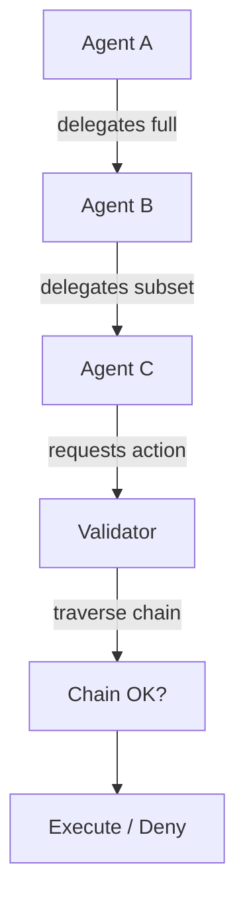

# 48: Agent Delegation Rules and Capability Boundaries (kAI / kOS)

This document defines the rules, structures, and lifecycle constraints governing agent delegation, impersonation limits, authority inheritance, and capability scoping inside the kAI (Kind AI) and kOS (Kind OS) systems.

---

## I. Purpose

To enable:
- Secure and auditable delegation of tasks and permissions
- Controlled impersonation and role inheritance
- Isolation and revocation of delegated authority
- Context-sensitive capability exposure

---

## II. Directory Structure

```text
src/
└── delegation/
    ├── DelegationManager.ts         # Entry point for issuing, validating, and revoking
    ├── CapabilityResolver.ts         # Expands and resolves nested/inherited capabilities
    ├── DelegationValidator.ts       # Runtime checks and limits
    ├── ImpersonationRules.ts        # Constraints on who can act on behalf of whom
    ├── contexts/
    │   ├── ScopedContext.ts        # Defines contextual boundaries (e.g., memory, IO)
    │   └── LifecycleHooks.ts       # Hooks to trigger revocation or escalation
    └── proofs/
        ├── DelegationToken.ts        # Signed, time-limited capabilities
        └── DelegationChain.ts        # Nested, chained multi-party delegation
```

---

## III. Delegation Envelope

```ts
interface DelegationEnvelope {
  issuer: AgentIdentity;
  recipient: AgentIdentity;
  capabilities: string[];            // e.g., ["read:file", "write:log"]
  context?: string;                 // Optional execution scope
  issuedAt: string;                 // ISO8601
  expiresAt?: string;               // Optional expiry
  impersonation?: boolean;         // If true, acts as issuer
  signature: string;               // Ed25519
}
```

---

## IV. Rules of Delegation

| Rule | Description |
|------|-------------|
| R1 | Agents may only delegate capabilities they currently hold. |
| R2 | All delegations must be signed using the issuer’s identity key. |
| R3 | No infinite impersonation chains are allowed (max depth = 2). |
| R4 | Impersonation must be explicitly requested and declared. |
| R5 | Delegations must be revocable by the issuer at any time. |
| R6 | Expiry timestamps are required for impersonation envelopes. |
| R7 | Revoked tokens are blacklisted across trust domains (via KLP). |
| R8 | Every delegation event is auditable. |

---

## V. Impersonation Limitations

| Scope | Rules |
|-------|-------|
| Memory | No inherited access unless context shared explicitly |
| Filesystem | Read-only mirror of issuer scope |
| Prompt Context | Hidden unless reissued by original prompt owner |
| Agent Spawning | Disallowed for impersonators unless explicitly granted |

---

## VI. Chain of Delegation

Nested chains of trust are supported via recursive `DelegationEnvelope`s. This allows agents to forward responsibility but not ownership of capability.

### Example:
```
Agent A delegates to B, B delegates subset to C:

A --> B [full access]
       B --> C [read-only, expires in 5 min]
```

The `DelegationChain.ts` module is responsible for validating:
- No circular references
- All chain links signed
- All expirations valid
- Least privilege enforced

---

## VII. Enforcement Points

Enforced by `DelegationValidator`:
- On message send (cross-agent calls)
- On memory and file access
- On action execution (e.g., spawn, write, delete)
- At orchestration layer before task delegation

---

## VIII. Auditing and Revocation

Every delegation issued is written to an audit trail:
- Includes issuer, recipient, scope, reason
- Chain stored with root hash
- Queryable by agent ID or time

Revocations are propagated:
- Locally (blacklist in cache)
- Optionally via `klp://trust/delegation-revocations`

---

## IX. Visual Flow



---

## X. Roadmap

| Feature                            | Target Version |
|-----------------------------------|----------------|
| zkDelegation proof-of-capability  | v1.3           |
| DAO endorsement-based delegation  | v1.5           |
| UI Delegation Grant Manager       | v2.0           |


This system forms the backbone of secure agent-to-agent delegation in kAI/kOS while preserving auditability, least privilege, and the principle of revocation-first authorization.

