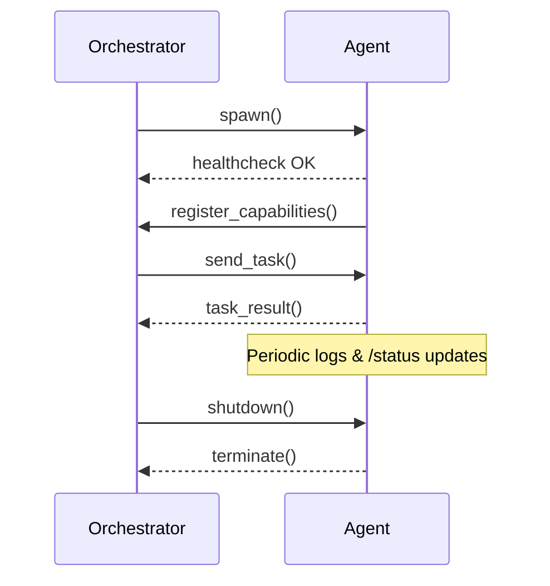

# 69: Agent Runtime Environment & Containerization

This document defines the architecture, dependencies, containerization, and runtime sandboxing mechanisms required to safely execute, scale, and maintain agents in the kAI/kOS ecosystem.

---

## I. Purpose

To ensure:

- Secure execution of autonomous agents
- Reproducible, isolated environments per agent
- Horizontal scalability and hot-reloadability
- Compliance with security and resource boundaries

---

## II. Runtime Environment Overview

Every agent runs in a self-contained containerized environment with strict isolation policies.

### A. Runtime Targets

- **Python 3.11+** (primary runtime)
- **Node.js 20+** (UI-centric or hybrid agents)
- **Nim / Rust / Go** (future, performance or native-level agents)

### B. OS Environment

- **Base Image:** Ubuntu 22.04 LTS or Alpine (for minimal agents)
- **Shell:** bash / sh
- **Agent Entrypoint:** `/agent/entrypoint.py` or `/app/start.sh`

---

## III. Directory Layout (Within Container)

```text
/agent/
├── entrypoint.py               # Main loop or orchestration logic
├── config.yaml                 # Agent-specific settings
├── requirements.txt            # Python deps
├── package.json                # (optional) Node.js deps
├── runtime/
│   ├── memory_store.json       # Temporary state memory
│   └── cache/                  # In-memory scratch space
├── secrets/
│   └── vault.json              # Mounted vault credentials (read-only)
└── logs/
    └── runtime.log             # All stdout/stderr
```

---

## IV. Containerization

### A. Dockerfile Template (Python Agent)

```Dockerfile
FROM python:3.11-slim
WORKDIR /agent
COPY requirements.txt ./
RUN pip install --no-cache-dir -r requirements.txt
COPY . .
CMD ["python", "entrypoint.py"]
```

### B. Container Policies

- **Resource Limits:**
  - CPU: 1 core (default)
  - RAM: 512MB (default, configurable)
- **Networking:**
  - Internal mesh via kLink
  - No external access unless explicitly enabled
- **File System:**
  - Read-only root FS
  - `/agent/runtime/` and `/agent/logs/` are writable

### C. Optional Add-ons

- **Nvidia GPU Runtime** for model inference agents
- **OCI Runtime Hooks** for custom sandboxing (e.g., nsjail)

---

## V. Orchestration Layer (kOS)

Managed by the **Agent Mesh Orchestrator** service:

- Spawns, stops, updates agent containers
- Monitors health (via heartbeat or healthcheck endpoints)
- Logs and event collection via Fluentbit + Loki
- Persistent agent state snapshots

### Example Compose File (Agent + Orchestrator)

```yaml
version: '3.8'
services:
  orchestrator:
    image: kos/agent-orchestrator:latest
    ports: [8080]
    volumes:
      - ./orchestrator/config:/config
  my-agent:
    build: ./my-agent
    restart: unless-stopped
    environment:
      - AGENT_CONFIG=/agent/config.yaml
    networks:
      - klp-mesh
networks:
  klp-mesh:
    driver: bridge
```

---

## VI. Agent Health & Runtime Diagnostics

### A. Health Signals

- `/healthz` (HTTP GET): Returns 200 if alive
- `/status` (HTTP GET): JSON payload with memory, CPU, and task status

### B. Logging

- All stdout/stderr written to `logs/runtime.log`
- Captured by orchestrator for centralized monitoring

### C. Memory Debugging (Optional)

- Attach debug interface on `/debug/socket`
- Expose interactive REPL with live memory inspection

---

## VII. Secure Runtime Constraints

- **Filesystem sandboxing:** No write access outside `/agent/`
- **Secrets injection:** Read-only mount of per-agent vault at `/agent/secrets/vault.json`
- **No root user:** Container runs as UID 1000
- **Capability dropping:** All Linux capabilities dropped except `CAP_NET_BIND_SERVICE` (if needed)

---

## VIII. Lifecycle Events



---

## IX. Summary

The Agent Runtime & Containerization stack ensures modular, secure, and reproducible execution environments for every Kind agent. Combined with orchestration, observability, and vault management, it creates a powerful substrate for decentralized intelligence.

Next document: **70: Agent Types & Classification System**

