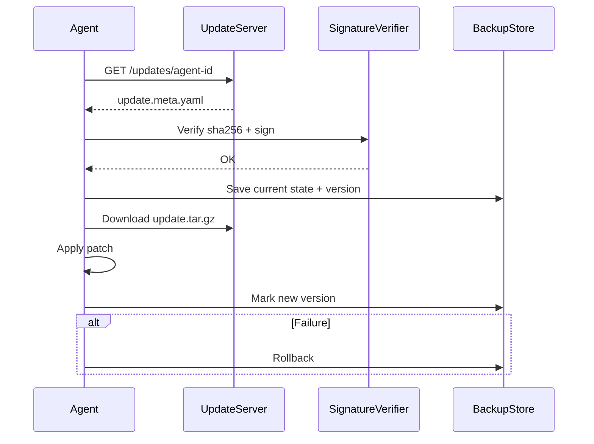

# 81: Agent Update & Health Protocol

This document specifies the complete protocol stack for agent self-updates, integrity verification, patch rollouts, downgrade handling, and liveness monitoring for agents running in the `kAI` and `kOS` systems.

---

## I. Update Channels & Eligibility

### A. Supported Update Channels

| Channel     | Purpose                         | Stability   | Who Uses It       |
|-------------|----------------------------------|-------------|-------------------|
| `stable`    | Fully tested, audit-passed      | High        | User agents       |
| `beta`      | Feature candidates               | Medium      | Dev/test systems  |
| `nightly`   | Latest commits                   | Low         | Experimental swarms |

### B. Eligibility Rules
- Agents must declare `update_channel` in `agent.meta.json`
- System core agents can only run `stable` unless flagged as dev instance
- Agents with `linked.trust` authority must verify update signatures


---

## II. Update Manifest Format (`update.meta.yaml`)

```yaml
id: agent-scheduler-001
version: 0.5.1
channel: stable
sha256: abcd1234ef567...
url: https://updates.kai.net/agent-scheduler-001/0.5.1.tar.gz
release_notes: |
  - Improved calendar sync
  - Bug fix: invalid timezones
mandatory: false
downgrade_allowed: true
rollout:
  staged: true
  batch_percent: 10
  start_time: 2025-06-25T00:00:00Z
  end_time: 2025-07-01T00:00:00Z
```


---

## III. Update Flow



---

## IV. Integrity Validation

### A. Hashing
- SHA-256 for all artifacts
- Stored alongside each deployed version

### B. Signature Authority
- Root: `kindos.kai.net/root.pub`
- Delegated: Signed by trusted agent controllers (e.g., `orchestrator.kai`)
- Local override for dev mode only

### C. Self-Test
- Run post-install integrity check on agent modules
- Log results to `audit.log`


---

## V. Rollback Logic

### Triggered If:
- Agent fails post-install validation
- Critical error in `error.log`
- User manual revert request

### Rollback Action:
- Restore from `BackupStore`
- Invalidate bad version with reason
- Block reattempt unless new `sha256` detected


---

## VI. Health Monitoring

### A. Health Beacon Protocol (HBP)
- Agents must send heartbeat every N seconds
- Format:
```json
{
  "id": "agent-vault-001",
  "status": "alive",
  "version": "0.4.3",
  "uptime": 35201,
  "error_count": 0
}
```

### B. Monitoring Tools
- `kOS.AgentMonitor`
- Dashboard view in MCP
- Fallback CLI: `kai agent status --watch`

### C. Auto-Recovery Rules
- Restart agent on memory overrun
- Trigger alert on repeated failure
- Use `agent.restart.sh` with cooldown timer

---

## VII. Security Considerations

- No update is applied without valid cryptographic signature
- All critical agent actions are logged
- Update URLs must use HTTPS only
- Update server DNS must resolve to approved domain list


---

### Changelog
- 2025-06-20 • Initial update and health protocol draft

