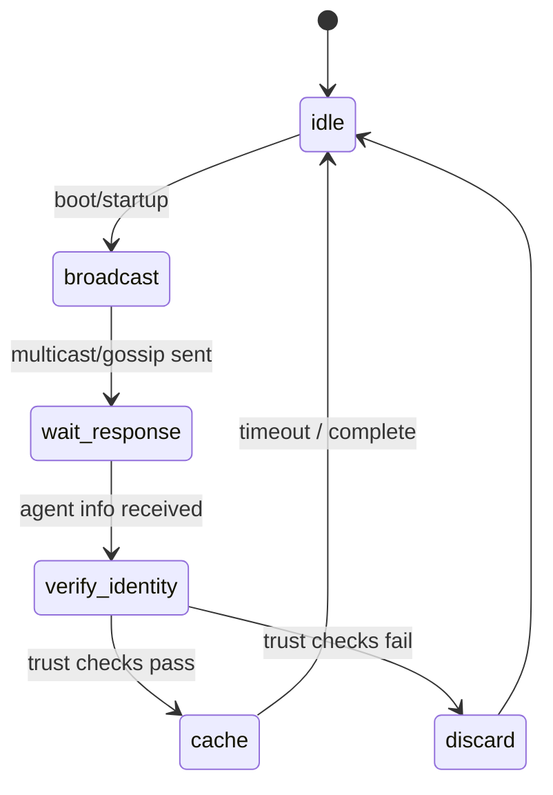

# 84: Agent Discovery Protocols

This document defines how agents in the `kAI` and `kOS` ecosystems discover each other securely, efficiently, and in both online and offline environments. It includes trust handshakes, service broadcasting, identity proofing, and fallback discovery methods.

---

## I. Discovery Layers

### A. Local Network Discovery

- **Protocol:** mDNS (Multicast DNS)
- **Port:** 5353
- **Payload:** `kind-agent-broadcast`
- **Contents:**
  - Agent ID
  - Capabilities
  - Auth Method
  - Preferred Port

### B. Mesh Discovery (Offline / Reticulum)

- **Protocol:** `klp.mesh.discovery`
- **Addressing:** Deterministic overlay node addresses based on ECC public keys
- **Gossip Interval:** Adjustable between 5–120s
- **Payload:**
  - ECC-signed identity blob
  - Compressed capabilities list (Bloom filter optional)
  - Epoch timestamp

### C. Cloud-Facilitated Discovery (Optional)

- **Host:** `discovery.kindos.network`
- **API:** `POST /announce`, `GET /agents`
- **Uses:** Bootstrap for global agents, or fallback if peer discovery fails
- **Authentication:**
  - Bearer token
  - ECC signature challenge-response

---

## II. Identity Proofing

### A. Self-Signed Identity Envelope

```json
{
  "agent_id": "planner-004",
  "pubkey": "04a9ef...",
  "signed": {
    "capabilities": ["schedule", "reasoning"],
    "version": "0.3.1",
    "host": "192.168.1.44",
    "port": 7702,
    "timestamp": 1718823142
  },
  "signature": "MEYCIQC..."
}
```

### B. Chain-of-Trust Verification

- Validates:
  - Timestamp (± max\_skew)
  - Host identity signature
  - Revocation list (optional)
- Agents may cache known trusted IDs in their local keyring

---

## III. Capabilities Directory Schema

```json
{
  "agent_id": "analytics-01",
  "description": "Local metrics aggregation agent",
  "capabilities": [
    "log_ingest",
    "metric_rollup",
    "db_adapter[qdrant]"
  ],
  "interfaces": [
    {
      "protocol": "http",
      "port": 8900,
      "route": "/metrics"
    },
    {
      "protocol": "klp",
      "mesh": true,
      "addr": "kind://a87f19..."
    }
  ],
  "auth": "none"
}
```

---

## IV. Discovery State Machine



---

## V. Fallback and Redundancy

### A. Cached Discovery Snapshots

- **Store:** Local filesystem or SQLite
- **Used When:** No discovery packets seen after `N` intervals

### B. Manual Agent Injection (Last Resort)

- **GUI:** Agent Admin Panel > Manual Add
- **Fields:**
  - IP/Port
  - Agent ID
  - Capability descriptor
  - Optional public key

---

## VI. Security Considerations

- Use of signed identity blobs prevents spoofing
- Rate-limiting discovery responses
- Optional CAPTCHAs for cloud bootstrap agents
- Revocation lists for misbehaving agents
- Replay attack protection via timestamps

---

### Changelog

– 2025-06-20 • Initial protocol spec

