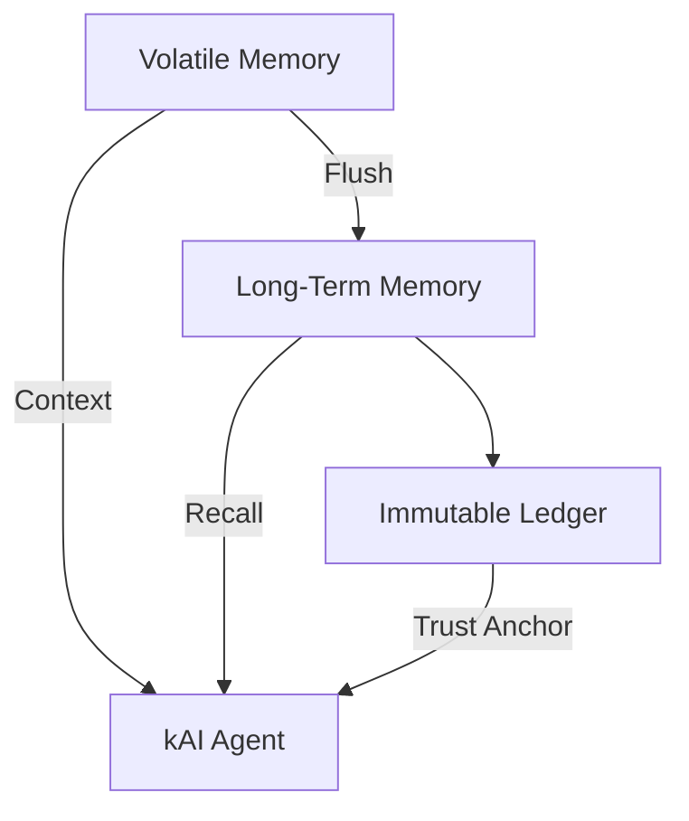

# 90: Memory Systems Architecture (Volatile, Long-Term, Immutable)

This document outlines the architecture, component breakdown, data schema, and protocol interfaces for memory systems within `kAI` and `kOS`. Memory types include volatile (session), long-term (persistent), and immutable (auditable). These systems are modular, independently scalable, and can interoperate across agent and human nodes.

---

## I. Memory Tiers Overview

### A. Volatile Memory (Short-Term / Session-Based)

- **Storage:** In-memory only (RAM, IndexedDB, Redis ephemeral)
- **Scope:** Per session / per request / temporary context
- **Access:** Fast, high-availability cache layer
- **Use Cases:** Ongoing conversations, temp computations, context injection

### B. Long-Term Memory (Persistent)

- **Storage:** PostgreSQL, SQLite, Redis (durable), Qdrant
- **Scope:** Per agent, per user, system-wide
- **Access:** SQL / API / indexed semantic search
- **Use Cases:** Agent training, history reconstruction, user behavior modeling

### C. Immutable Memory (Audit / Historical / Blockchain-Synced)

- **Storage:** IPFS, Git-based snapshots, Write-once logs, Blockchain (optional)
- **Scope:** Shared/public or sensitive logs
- **Access:** Merkle-hashed references, read-only APIs
- **Use Cases:** Compliance, provenance, high-integrity logs, zero-trust operations

---

## II. Memory System Stack



---

## III. Volatile Memory Implementation

### A. Agent Volatile Store

- **Backend:** Jotai Store (frontend), Python dict (backend), Redis (ephemeral)
- **Reset Policy:** TTL (e.g. 10 mins), Manual reset, Session close
- **Keys:** `session_id`, `thread_id`, `context_snapshot`
- **Structure:**

```json
{
  "session_id": "abc123",
  "messages": [
    { "role": "user", "text": "Hello?" },
    { "role": "agent", "text": "How can I help?" }
  ],
  "token_budget": 4000
}
```

---

## IV. Long-Term Memory Schema

### A. Relational (PostgreSQL)

```sql
CREATE TABLE agent_memory (
  id UUID PRIMARY KEY,
  agent_id TEXT,
  user_id TEXT,
  created_at TIMESTAMP,
  updated_at TIMESTAMP,
  memory_type TEXT, -- factual, experiential, narrative
  content TEXT,
  embedding VECTOR(1536),
  source TEXT,
  tags TEXT[],
  trust_score FLOAT
);
```

### B. Vector Index (Qdrant)

- **Collection Name:** `kai-agent-memories`
- **Metadata Schema:**

```json
{
  "agent_id": "planner-001",
  "user_id": "stone",
  "tags": ["nutrition", "health"],
  "source": "user-input"
}
```

- **Embedding Model:** OpenAI ada-002 or local MiniLM

---

## V. Immutable Memory

### A. Git + IPFS Sync

- **Strategy:** Snapshots pushed to Git repo + pinned to IPFS
- **Trigger:** Every N commits, daily, or manual export
- **Format:** Markdown or JSON
- **Hashing:** SHA-256 hash chains

### B. Blockchain Log (Optional)

- **Chain:** Polygon, Avalanche, Filecoin
- **Structure:**

```json
{
  "timestamp": "2025-06-20T15:34:00Z",
  "agent_id": "vault-001",
  "action": "access_memory",
  "hash": "bc87...fa91"
}
```

---

## VI. Memory Management Protocols

### A. Save Memory

```http
POST /api/agent/memory
{
  "content": "User asked about vitamin D.",
  "tags": ["health", "vitamins"],
  "source": "chat",
  "memory_type": "factual"
}
```

### B. Recall Memory

```http
GET /api/agent/memory?query=vitamin%20D
```

### C. Memory Integrity Check

- Scheduled hashing validation
- `agent --audit-memory`
- Result: diff of expected vs current hash chain

---

## VII. Access Control

- **RBAC:** Role-based access for agents/users
- **Granular Permissions:**
  - Read-only
  - Append-only
  - Full access
- **Token-Scoped:** JWT claims define allowed memory tier access

---

## VIII. Notes & Future Features

- **Federated Memory Graph:** Shared memory across mesh agents
- **Decay Modeling:** Older memories lose recall weight unless reinforced
- **Sentiment Drift:** Tag memories with emotional weight
- **Memory Compression:** Periodic summarization of redundant or verbose records

---

### Changelog

– 2025-06-21 • Initial draft of memory system design

