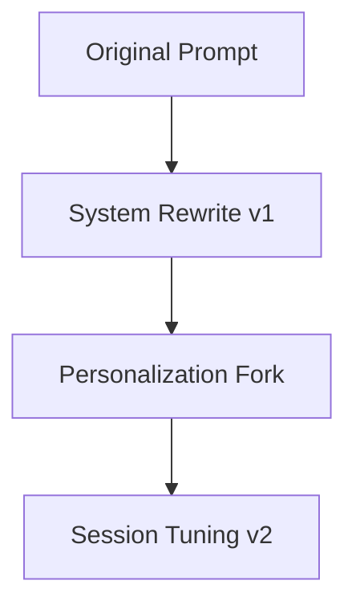

# 94: Prompt Manager System

This document outlines the architecture, behavior, configuration, and storage model of the Prompt Manager subsystem within `kAI` and `kOS`, providing granular control over prompt versions, metadata, execution history, and secure usage policies.

---

## I. System Purpose

To enable robust creation, classification, storage, sharing, transformation, and execution of prompts across agents, users, sessions, and services, with full traceability and metadata.

---

## II. Core Functions

- **Prompt Versioning**
- **Semantic Categorization**
- **Execution Tracking**
- **Access Control**
- **Prompt Templates**
- **Secure Sharing**
- **Prompt Mutation Graphs**
- **Prompt Debugging Logs**

---

## III. Directory Structure

```text
/prompt-manager
├── prompt_store.db              # SQLite / PostgreSQL (configurable)
├── templates/                   # Predefined prompt templates
│   ├── assistant_help.md
│   ├── summarizer.md
│   └── researcher.md
├── history/                     # Execution logs and usage history
│   ├── 2025-06-20-logs.json
│   └── ...
├── snapshots/                  # Prompt state snapshots
│   ├── v1_early_draft.json
│   └── v2_final_copy.json
├── mutations/                  # Graph of changes across prompt versions
├── exports/                    # Externally shared prompts
├── access/                     # ACL definitions for private/shared prompts
└── config.yaml                 # System-wide settings
```

---

## IV. Prompt Object Schema

```json
{
  "id": "prompt-3245",
  "title": "Secure Assistant Onboarding",
  "tags": ["security", "init", "bootstrap"],
  "author": "system",
  "created_at": "2025-06-20T14:32:00Z",
  "version": 3,
  "content": "You are a secure initialization assistant...",
  "template_vars": ["user_name", "device_id"],
  "system_level": true,
  "mutated_from": "prompt-3102",
  "dependencies": ["vault", "auth"],
  "permissions": {
    "read": ["admin", "user"],
    "write": ["admin"]
  }
}
```

---

## V. Configuration (`config.yaml`)

```yaml
backend: sqlite
max_versions_per_prompt: 20
mutation_tracking: true
default_acl:
  read: ["user"]
  write: ["admin"]
export_encryption: true
template_engine: jinja2
```

---

## VI. APIs

- `GET /prompts` – List prompts
- `POST /prompts` – Create new prompt
- `PUT /prompts/:id` – Update existing prompt
- `DELETE /prompts/:id` – Remove prompt
- `POST /prompts/:id/run` – Execute prompt
- `GET /prompts/:id/history` – View run history
- `GET /templates` – List available templates
- `POST /export` – Encrypt + share prompt

---

## VII. Prompt Execution Trace

Each prompt execution records:

- Prompt ID + Version
- Resolved Variables
- Start + End Time
- Agent ID executing
- Output Snippet (first 500 chars)
- Error log (if any)

---

## VIII. Prompt Mutation Graph

Visualized with Mermaid or Graphviz. Shows:

- Forked versions
- Merges
- System updates
- Manual rewrites



---

## IX. Prompt Template Example

```jinja2
Hello {{ user_name }},

Welcome to your secure environment.
Your assigned device ID is {{ device_id }}.
Please confirm voiceprint by saying:
"The quick brown fox jumps over the lazy dog."
```

---

## X. Permissions and Sharing

- ACL per prompt
- Export via shareable encrypted blob
- Public Registry for opt-in prompts
- Access tracking logs

---

## XI. Planned Features

- Prompt Pack Installer (`.kprompts` bundles)
- AI-assisted Prompt Mutation Review
- Inline Prompt Test Suite
- Prompt Reliability Scoring

---

### Changelog

– 2025-06-21 • Initial system spec

