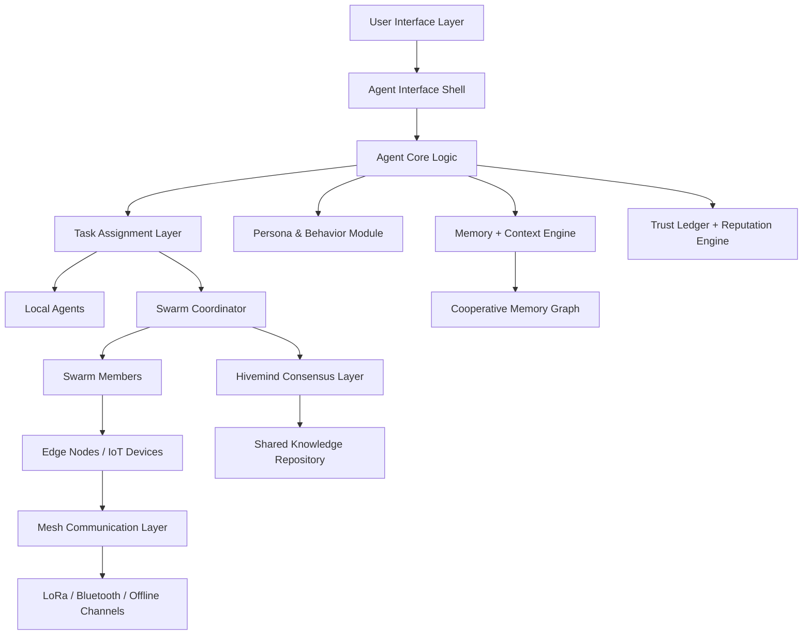
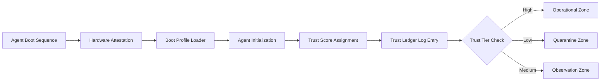
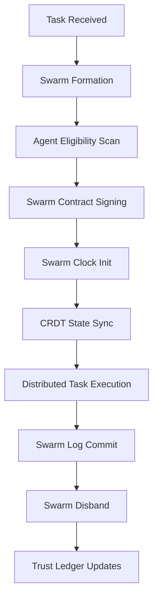
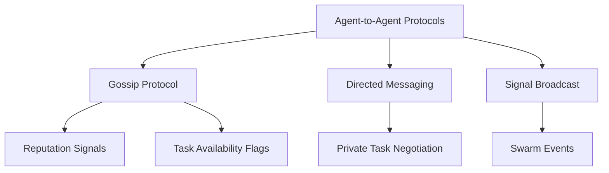

## 🧭 Mermaid Diagrams — Mobile AI Cluster Ecosystem Maps

### 🧠 System-Level Overview

---

### 🧩 Subsystem: Agent Boot & Trust Lifecycle

---

### 🔁 Subsystem: Swarm Lifecycle

---

### 📡 Subsystem: Communication Channels

---

Let me know if you want:
- Versions broken down per document group (001–099, 100–199, etc.)
- Exported as SVG/PNG/Markdown files
- Embedded into UI dashboards

