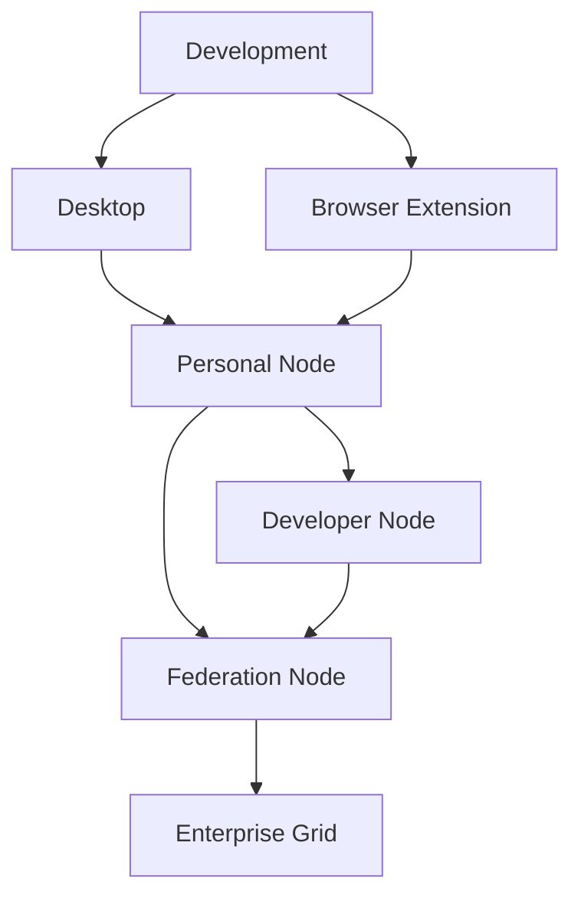

# Deployment Profiles

## Agent Context
**For AI Agents**: This document describes deployment profiles for Kai-CD and future kOS environments. Use this to understand deployment options, configuration strategies, and infrastructure requirements when setting up or managing deployments.

## Overview

Deployment profiles define standardized configurations for deploying Kai-CD across different environments, from local development to enterprise-scale kOS deployments. Each profile encapsulates environment-specific settings, service configurations, and infrastructure requirements.

## Current Deployment Modes

### Local Development Profile

**Target**: Developer workstations and local testing
**Configuration**: `configs/profiles/development.yaml`

```yaml
profile: development
environment: local
services:
  llm_backend: ollama
  vector_db: chroma
  storage: local_filesystem
  cache: memory
security:
  vault: local_encrypted
  auth: development_mode
  tls: self_signed
logging:
  level: debug
  output: console
networking:
  host: localhost
  ports:
    api: 8000
    frontend: 3000
    vault: 3001
```

**Characteristics**:
- Single-user environment
- Local service dependencies
- Development-friendly logging
- Minimal security constraints
- Fast iteration cycle

### Browser Extension Profile

**Target**: Chrome/Edge browser extension deployment
**Configuration**: Built into extension manifest

```json
{
  "profile": "browser_extension",
  "environment": "browser",
  "storage": {
    "type": "chrome_storage",
    "encryption": "web_crypto_api"
  },
  "services": {
    "local_only": true,
    "external_apis": "user_configured"
  },
  "security": {
    "content_security_policy": "strict",
    "permissions": "minimal_required"
  }
}
```

**Characteristics**:
- Sandboxed browser environment
- Chrome storage API integration  
- Content Security Policy compliance
- User permission-based access
- Cross-origin request handling

### Standalone Desktop Profile

**Target**: Electron/Tauri desktop applications
**Configuration**: `configs/profiles/desktop.yaml`

```yaml
profile: desktop
environment: standalone
services:
  llm_backend: ollama
  vector_db: qdrant
  storage: local_filesystem
  database: sqlite
security:
  vault: encrypted_local
  auth: biometric_optional
  auto_lock: true
ui:
  theme: system_preference
  window_state: persistent
  tray_integration: true
```

**Characteristics**:
- Native desktop integration
- Local data storage
- System-level permissions
- Offline capability
- Platform-specific features

## Future kOS Deployment Profiles

### Personal Node Profile

**Target**: Single-user kOS installation
**Configuration**: `configs/profiles/personal_node.yaml`

```yaml
profile: personal_node
environment: kos_personal
orchestration:
  enabled: true
  agent_mesh: local
services:
  llm_backends:
    - ollama
    - openai_compatible
  vector_db: qdrant
  graph_db: neo4j_community
  message_bus: redis
  storage: encrypted_local
federation:
  klp_enabled: false
  discovery: local_only
agents:
  core_agents:
    - scheduler
    - memory_manager
    - task_planner
  optional_agents:
    - companion
    - productivity
    - creative
```

### Developer Node Profile

**Target**: Development and testing of kOS agents
**Configuration**: `configs/profiles/developer_node.yaml`

```yaml
profile: developer_node
environment: kos_development
orchestration:
  enabled: true
  agent_mesh: full
  debugging: true
services:
  llm_backends:
    - ollama
    - vllm
    - openai_compatible
  vector_db: qdrant
  graph_db: neo4j
  message_bus: redis_cluster
  monitoring:
    - prometheus
    - grafana
federation:
  klp_enabled: true
  test_network: true
development:
  hot_reload: true
  agent_inspector: true
  memory_debugging: true
  trace_logging: verbose
```

### Community Federation Node

**Target**: Public kOS federation participation
**Configuration**: `configs/profiles/federation_node.yaml`

```yaml
profile: federation_node
environment: kos_federation
orchestration:
  kubernetes: optional
  agent_mesh: federated
  load_balancing: true
services:
  llm_backends:
    - multiple_providers
  vector_db: weaviate_cluster
  graph_db: dgraph
  message_bus: nats_cluster
federation:
  klp_enabled: true
  public_registry: true
  trust_network: community
  handshake_required: true
security:
  identity_verification: required
  audit_logging: comprehensive
  access_control: rbac
scaling:
  horizontal: true
  auto_scale: true
  resource_limits: configured
```

### Enterprise Grid Profile

**Target**: Large-scale enterprise deployments
**Configuration**: `configs/profiles/enterprise.yaml`

```yaml
profile: enterprise
environment: kos_enterprise
orchestration:
  kubernetes: required
  helm_charts: kindos_enterprise
  service_mesh: istio
services:
  llm_backends:
    - enterprise_apis
    - private_models
  vector_db: weaviate_enterprise
  graph_db: neo4j_enterprise
  message_bus: kafka_cluster
  databases:
    - postgresql_cluster
    - redis_enterprise
federation:
  klp_enabled: true
  private_network: true
  enterprise_trust: required
security:
  authentication:
    - ldap
    - saml
    - oauth2
  encryption: end_to_end
  compliance:
    - sox
    - gdpr
    - hipaa
monitoring:
  observability: full_stack
  alerting: enterprise
  audit: comprehensive
backup:
  strategy: multi_region
  encryption: required
  retention: policy_based
```

## Configuration Management

### Profile Structure

```
configs/
├── profiles/
│   ├── development.yaml          # Local development
│   ├── browser_extension.json    # Browser extension
│   ├── desktop.yaml              # Standalone desktop
│   ├── personal_node.yaml        # kOS personal
│   ├── developer_node.yaml       # kOS development
│   ├── federation_node.yaml      # kOS federation
│   └── enterprise.yaml           # kOS enterprise
├── environments/
│   ├── local.env                 # Local environment variables
│   ├── staging.env               # Staging environment
│   └── production.env            # Production environment
├── secrets/
│   ├── development.vault         # Development secrets
│   ├── staging.vault             # Staging secrets
│   └── production.vault          # Production secrets
└── overrides/
    ├── user_overrides.yaml       # User-specific overrides
    └── site_overrides.yaml       # Site-specific overrides
```

### Configuration Hierarchy

1. **Base Profile**: Default configuration for deployment type
2. **Environment Overrides**: Environment-specific modifications
3. **Site Overrides**: Organization or site-specific settings
4. **User Overrides**: Individual user customizations

### Dynamic Configuration

```typescript
// Configuration loading system
interface DeploymentConfig {
  profile: string;
  environment: string;
  services: ServiceConfig;
  security: SecurityConfig;
  networking: NetworkConfig;
  features: FeatureFlags;
}

class ConfigManager {
  async loadProfile(profileName: string): Promise<DeploymentConfig> {
    const baseConfig = await this.loadBaseProfile(profileName);
    const envOverrides = await this.loadEnvironmentOverrides();
    const siteOverrides = await this.loadSiteOverrides();
    const userOverrides = await this.loadUserOverrides();
    
    return this.mergeConfigurations([
      baseConfig,
      envOverrides,
      siteOverrides,
      userOverrides
    ]);
  }
}
```

## Infrastructure Requirements

### Resource Requirements by Profile

| Profile | CPU | Memory | Storage | Network |
|---------|-----|--------|---------|---------|
| Development | 2 cores | 4GB | 20GB | Local |
| Browser Extension | N/A | 100MB | 1GB | HTTP/HTTPS |
| Desktop | 2 cores | 4GB | 50GB | Local/Internet |
| Personal Node | 4 cores | 8GB | 100GB | Home Network |
| Developer Node | 8 cores | 16GB | 500GB | High Bandwidth |
| Federation Node | 16 cores | 32GB | 1TB | Public Internet |
| Enterprise Grid | Variable | Variable | Variable | Enterprise Network |

### Service Dependencies

#### Core Services (All Profiles)
- Configuration management
- Logging system
- Basic security
- User interface

#### Standard Services (Most Profiles)
- LLM backend integration
- Vector database
- Local storage
- Cache layer

#### Advanced Services (kOS Profiles)
- Agent orchestration
- Message bus
- Graph database
- Federation protocols
- Monitoring and observability

#### Enterprise Services (Enterprise Profile)
- Kubernetes orchestration
- Service mesh
- Enterprise authentication
- Compliance monitoring
- Multi-region backup

## Deployment Automation

### Profile Selection

```bash
# Automatic profile detection
kai deploy --auto-detect

# Explicit profile selection
kai deploy --profile=developer_node

# Profile with overrides
kai deploy --profile=enterprise --env=production --site=datacenter1
```

### Infrastructure as Code

```yaml
# Terraform configuration for kOS deployment
resource "kubernetes_namespace" "kos" {
  metadata {
    name = var.kos_namespace
  }
}

resource "helm_release" "kos_core" {
  name       = "kos-core"
  repository = var.kos_helm_repo
  chart      = "kos"
  namespace  = kubernetes_namespace.kos.metadata[0].name
  
  values = [
    file("${path.module}/profiles/${var.deployment_profile}.yaml")
  ]
}
```

### Container Orchestration

```yaml
# Docker Compose for development profile
version: '3.8'
services:
  kos-api:
    image: kos/api:latest
    environment:
      - PROFILE=development
      - CONFIG_PATH=/config/development.yaml
    volumes:
      - ./configs:/config
      - ./data:/data
    ports:
      - "8000:8000"
  
  ollama:
    image: ollama/ollama:latest
    volumes:
      - ollama_data:/root/.ollama
    ports:
      - "11434:11434"
  
  qdrant:
    image: qdrant/qdrant:latest
    volumes:
      - qdrant_data:/qdrant/storage
    ports:
      - "6333:6333"

volumes:
  ollama_data:
  qdrant_data:
```

## Security Considerations

### Profile-Specific Security

#### Development Profile
- Relaxed security for development speed
- Self-signed certificates acceptable
- Debug logging enabled
- Local-only access

#### Production Profiles
- Strict security policies
- Valid TLS certificates required
- Audit logging mandatory
- Access control enforced

#### Federation Profiles
- Identity verification required
- Encrypted inter-node communication
- Trust network participation
- Reputation system integration

### Security Configuration

```yaml
# Security configuration template
security:
  authentication:
    methods: [jwt, oauth2, biometric]
    session_timeout: 3600
    mfa_required: false
  encryption:
    at_rest: aes256
    in_transit: tls13
    key_rotation: enabled
  access_control:
    type: rbac
    default_deny: true
    audit_all: true
  compliance:
    frameworks: [gdpr, ccpa]
    data_retention: 90d
    audit_retention: 7y
```

## Monitoring and Observability

### Profile-Specific Monitoring

#### Development Profile
- Basic console logging
- Local metrics collection
- Simple health checks

#### Production Profiles
- Comprehensive metrics
- Distributed tracing
- Alerting and notifications
- Performance monitoring

#### Enterprise Profile
- Full observability stack
- Compliance monitoring
- Security event correlation
- Business metrics tracking

### Monitoring Stack

```yaml
# Monitoring configuration
monitoring:
  metrics:
    prometheus:
      enabled: true
      retention: 30d
    grafana:
      enabled: true
      dashboards: kos_standard
  logging:
    loki:
      enabled: true
      retention: 90d
    elasticsearch:
      enabled: false
  tracing:
    jaeger:
      enabled: true
      sampling_rate: 0.1
  alerting:
    alertmanager:
      enabled: true
      routes: [email, slack, pagerduty]
```

## Migration Paths

### Profile Evolution



### Migration Tools

```bash
# Profile migration utility
kai migrate --from=development --to=personal_node
kai migrate --from=personal_node --to=federation_node --backup

# Configuration validation
kai validate --profile=enterprise --environment=production
```

## Best Practices

### Profile Selection Guidelines

1. **Start Simple**: Begin with development or desktop profiles
2. **Gradual Scaling**: Move to more complex profiles as needs grow
3. **Environment Parity**: Maintain consistency between environments
4. **Security First**: Choose appropriate security level for use case
5. **Resource Planning**: Ensure adequate resources for selected profile

### Configuration Management

1. **Version Control**: Store configurations in version control
2. **Secret Management**: Use proper secret management tools
3. **Environment Separation**: Maintain clear environment boundaries
4. **Documentation**: Document all configuration changes
5. **Testing**: Test configurations before deployment

### Operational Excellence

1. **Monitoring**: Implement appropriate monitoring for profile
2. **Backup**: Ensure proper backup strategies
3. **Updates**: Plan for regular updates and maintenance
4. **Disaster Recovery**: Prepare for failure scenarios
5. **Performance**: Monitor and optimize performance

## Conclusion

Deployment profiles provide a structured approach to deploying Kai-CD and future kOS systems across diverse environments. From simple local development to complex enterprise grids, each profile is designed to meet specific operational requirements while maintaining consistency and security.

The profile system enables smooth evolution from current Kai-CD deployments to sophisticated kOS federation networks, ensuring that users can start simple and scale as their needs grow. This approach balances immediate usability with long-term scalability and enterprise requirements. 