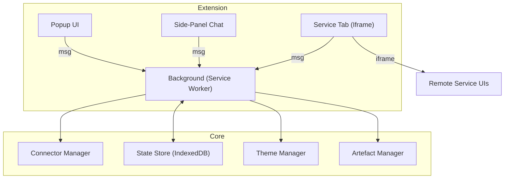

# 02_Tech_Architecture.md
# kai-cd – Technical Architecture

## Tech stack
* TypeScript 5
* React 19 + Vite (Manifest V3 build target)
* CSS Modules + CSS Variables (theme tokens)
* IndexedDB-backed storage via idb-keyval
* `webextension-polyfill` for cross-browser APIs
* Jest + React Testing Library for unit tests

## High-level components
1. **Background Service Worker** – message router, keeps connectors alive.
2. **ConnectorManager** – dynamic import + cache of `BaseConnector` subclasses.
3. **Popup UI** – quick controls & settings.
4. **Side-panel Chat** – LLM chat interface.
5. **Tab view** – iframe host for full remote UIs.
6. **Artefact Manager** – stores chat logs, images and metadata in IndexedDB.
7. **Theme Manager** – CSS variable switcher saved to storage.

A Mermaid diagram of data/control flow:

This diagram must be kept in sync with code changes. 