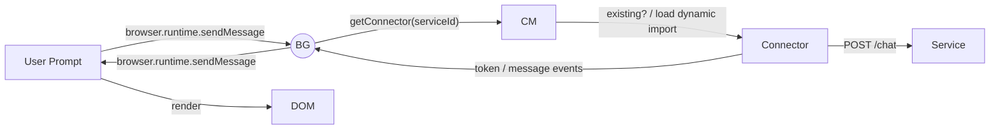

# 07_Data_Flow.md
# kai-cd – Data & Control Flow Details

This document describes how data moves through the extension at runtime.

## Legend
* BG – Background Worker
* UI – Any UI context (Popup, Panel, Tab)
* CM – ConnectorManager
* CT – Specific Connector (e.g. OpenAIConnector)
* DB – IndexedDB via StateStore

## 1. Chat Request Flow


## 2. Service CRUD
```mermaid
graph TD
  UI[Service Form Submit] --> BG
  BG --> DB[((settings))]
  DB --> BG
  BG --> CM
  CM --> (cache update)
  BG --> UI
```

## 3. Artefact Storage (image generated)
```mermaid
graph TD
  CT -- image bytes --> BG
  BG -- put(id, blob) --> DB_Image[((artefacts))]
  BG -- put(id_meta, meta) --> DB_Meta(((artefacts_meta)))
  BG --> UI_Gallery
```

## Error propagation
* Connectors throw typed `ConnectorError` objects `{ code, message }`.
* Background serialises to `{ success:false, error:{ code, message } }` for UI.
* UI shows toast and, if `code === 'auth'`, opens re-auth modal.

## Versioning & Migration
* DB schema version stored at key `meta:dbVersion`.
* On extension upgrade, `background/index.ts` checks version and runs incremental migration functions (`migrations/v1_to_v2.ts`, etc.).

---
*Document last updated: <!--timestamp placeholder-->* 