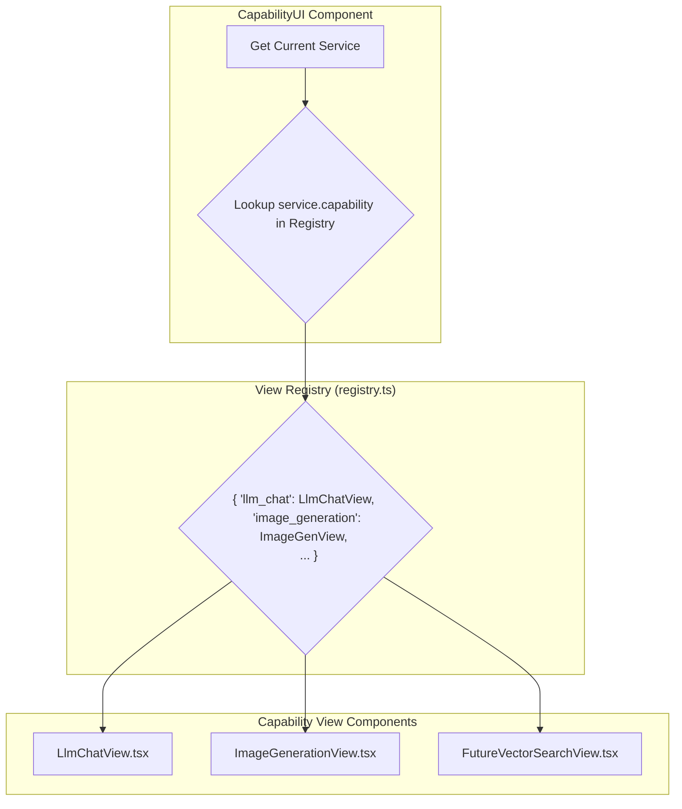

# 📐 16: UI Architecture

This document outlines the architecture of the Kai-CD user interface, focusing on its modular and extensible design.

## Core Principle: The View Registry

To ensure the application can be easily extended with new UI features and service types without requiring major refactoring, we use a "View Registry" pattern.

Instead of using a hardcoded `switch` statement to decide which UI to render for a given service, the application uses a dynamic lookup in a central registry.

### Flow Diagram

The following diagram illustrates how the `CapabilityUI` component dynamically renders the correct view based on a service's defined capability:

### Benefits of this Approach

1.  **Modularity:** Each capability's UI is a self-contained React component.
2.  **Extensibility:** To add a UI for a new service type (e.g., `vector_search`), a developer only needs to:
    -   Create the new view component (`VectorSearchView.tsx`).
    -   Add a single line to the registry file to associate the capability name with the component.
3.  **Maintainability:** This completely decouples the main layout component from the views it can render, making the code cleaner and easier to reason about. 

## State Management

The extension's state is managed by two primary Zustand stores:

- **`serviceStore.ts`**: The single source of truth for all configured services. It handles their definitions, credentials, URLs, and dynamic state like the last-used model for a chat service. It persists to `localStorage` and includes a data migration mechanism to handle schema changes between versions.

- **`viewStateStore.ts`**: A session-only store that tracks *where* a service is currently active. It holds the `activeServiceId` and the `activeLocation` (`'tab'` or `'panel'`). This allows different parts of the extension (popup, tab, panel) to stay synchronized.

- **`themeStore.ts`**: Manages the UI theme ('light', 'dark'). It's wrapped in a `ThemeProvider` that ensures the theme is consistently applied to all React roots.

## Navigation and View Synchronization

The extension employs a "smart" navigation system to provide a seamless user experience between the popup, full tabs, and the side panel.

- **Popup (`Popup.tsx`)**: Acts as the central controller.
  - When a service is clicked, it checks if a service tab is already open using `chrome.tabs.query`.
  - If a tab exists, it updates the `serviceStore` and `viewStateStore` and focuses the existing tab.
  - If no tab exists, it determines the best view context. Services with external UIs (`hasExternalUi: true`) are opened in a new tab via `switchToTab`. Services with native UIs (like chat) are opened in the side panel via `switchToPanel`.
  - This prevents duplicate tabs and ensures services open in their optimal context.

- **Tab View (`Tab.tsx`)**: A full-page container for a service.
  - It features a consistent header displaying the service name, IP address, and a "Switch to Panel" button.
  - Clicking this button calls `switchToPanel`, which saves the current state to the stores, opens the side panel with the same service, and then closes the tab.

- **Side Panel (`Sidepanel.tsx`)**: A compact view for focused interaction.
  - It also has a consistent header with a "Switch to Tab" button.
  - Clicking this button calls `switchToTab`, which saves state, opens the service in a new, full tab, and closes the panel.

This architecture ensures state is preserved during view transitions and that the user can fluidly move between a wide view and a docked panel view without losing their place. 