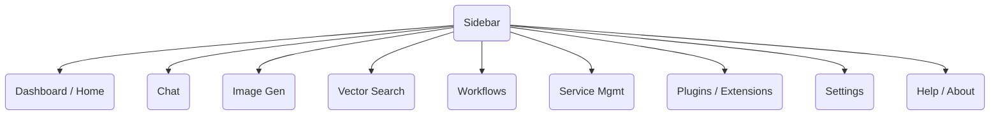
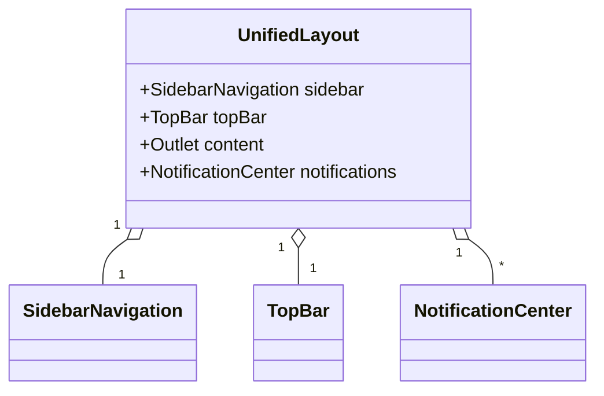
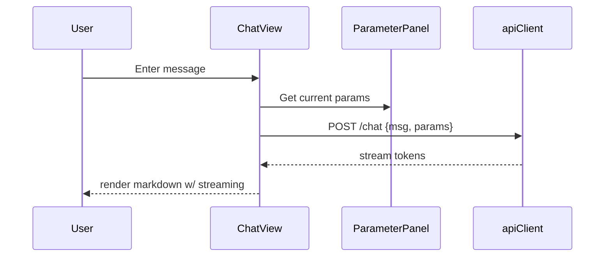
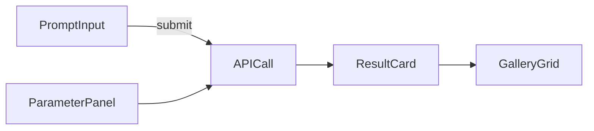
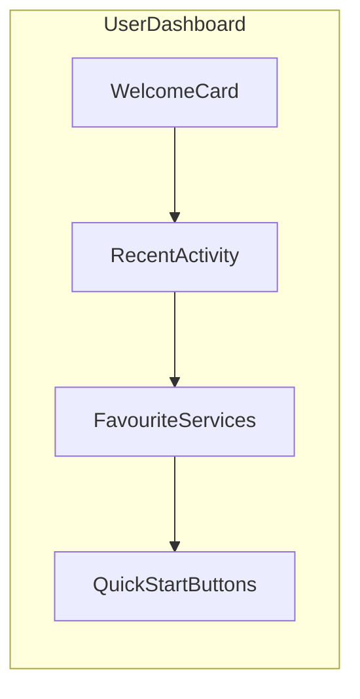
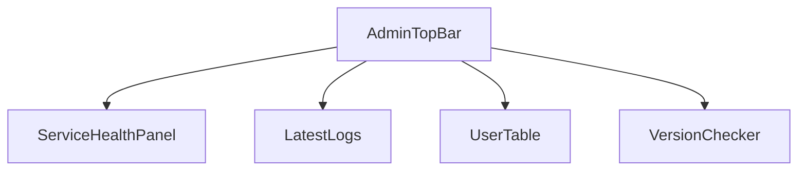

# 🎨 17: UI Redesign Plan

## 1. Purpose & Vision
Kai-CD's user interface must provide a polished, intuitive experience rivaling leading OSS tools such as **OpenWebUI**.  This document lays out the end-to-end redesign plan, including information architecture, component breakdowns, diagrams, and an implementation roadmap.

Goals:
1. Streamline common workflows (chatting with LLMs, generating images, managing services).
2. Provide consistent look-and-feel with theme support (light/dark, high-contrast).
3. Minimise cognitive load via clear navigation and progressive disclosure of advanced settings.
4. Embrace responsive design so the extension scales from narrow side-panel to full-tab view.

---

## 2. Inspiration: Key UX Patterns in OpenWebUI (OWU)
| Category | OpenWebUI Feature | Insight for Kai-CD |
|---|---|---|
| Navigation | Left, collapsible sidebar with icons & tool-tips | Adopt a similar sidebar hosting primary views. |
| Chat | Rich markdown rendering, code blocks, streaming tokens, model selector | Match functionality; extend ParameterControl into an always-visible slide-over pane. |
| Image Gen | Prompt history, preview gallery, parameter presets | Provide right-column parameters + bottom grid for results; allow drag-to-compare. |
| Themes | One-click theme switcher, user-saved palette | Re-use `themeStore` (see `src/store/themeStore.ts`) and expose theme toggle in top-bar. |
| Settings | Categorised settings modal | Convert SettingsView into modal routed via `/settings`. |
| Service Mgmt | Visual cards w/ status, add/edit flows | Refresh ServiceManagement with cards & inline health indicator. |

---

## 3. Gap Analysis (Current vs. Target)
```mermaid
flowchart TB
    subgraph Current
        A1[CapabilityUI] --> A2[LlmChatView]
        A1 --> A3[ImageGenerationView]
        A1 --> A4[ParameterControl (floating)]
    end
    subgraph Target (Inspired by OWU)
        B1[UnifiedLayout]
        B1 --> B2[SidebarNavigation]
        B1 --> B3[TopBar]
        B1 --> B4[ContentOutlet]
        B4 --> B5[ChatView]
        B4 --> B6[ImageGenView]
        B4 --> B7[VectorSearchView]
    end
    style Current fill:#f6d,opacity:0.2
    style Target fill:#dfd,opacity:0.2
```
Key Gaps:
* No global layout component – each HTML entry point duplicates boilerplate.
* ParameterControl UI not consistent across capabilities.
* Theme switching only wired in code; no visible control.
* Navigation scattered between tab / popup / side-panel builds.

---

## 4. Information Architecture & Navigation

*Sidebar collapsible to icons-only on narrow widths (<600 px).*

---

## 5. Wireframes & Component Trees

### 5.1 Global Shell (`UnifiedLayout`)


### 5.2 Chat View (`ChatView`)

Components:
* `MessageList`
* `MessageInput`
* `ModelSelector` (replaces dropdown in ParameterControl)
* `ParameterPanel` (slide over, hotkey `⌘/Ctrl + P`)

### 5.3 Image Generation View (`ImageGenView`)


### 5.4 Vector Search View (`VectorSearchView`)
Similar layout to Chat with query textbox + results list.

---

## 6. Component Mapping & Refactor Tasks
| New Component | Reuses / Replaces | Notes |
|---|---|---|
| `UnifiedLayout` | N/A | Host in `src/layout/UnifiedLayout.tsx`; consumed by Vite multi-page app. |
| `SidebarNavigation` | New | Links route changes via `react-router-dom`. |
| `TopBar` | Partially `SettingsView` | Houses theme toggle + active service + user avatar. |
| `ChatView` | `LlmChatView`, `ParameterControl` | Move parameters into slide-over; add streaming markdown renderer. |
| `ImageGenView` | `ImageGenerationView` | Split form vs gallery; parameter presets. |
| `VectorSearchView` | TBD | New capability. |
| `ServiceCards` | `ServiceManagement` | Card grid w/ status badge. |

---

## 7. Implementation Roadmap
1. **Phase 0 – Foundation**
   * Adopt design system (e.g., `tailwindcss` + `shadcn/ui` or `MUI`).
   * Introduce global theme context (`themeStore`) and CSS vars.
2. **Phase 1 – Layout & Navigation**
   * Build `UnifiedLayout`, `SidebarNavigation`, `TopBar`.
   * Refactor entry points (`popup`, `tab`, `sidepanel`) to share layout.
3. **Phase 2 – Chat View Revamp**
   * Port markdown renderer (`@uiw/react-markdown-preview`).
   * Enable token streaming UI.
4. **Phase 3 – Image Generation Revamp**
   * Implement two-column layout with resizable params panel.
   * Add gallery grid and prompt history.
5. **Phase 4 – Vector Search & Workflows**
   * Create `VectorSearchView` leveraging upcoming connectors.
   * Scaffold `WorkflowBuilder` (drag-and-drop DAG UI) – optional milestone.
6. **Phase 5 – Service Management & Settings**
   * Card-based service management with inline edit.
   * Settings modal with sections (General, Themes, Shortcuts).

Each phase concludes with accessibility audit (keyboard / screen reader) and E2E Cypress smoke tests.

---

## 8. UX & Visual Guidelines
* Typography: Inter, 14 px base, 1.5 line-height.
* Color: Tailwind gray-slate scale for neutrals, accent cyan-600.
* Motion: Use 150 ms ease-in-out transitions; avoid parallax.

## 8. Visual-Design System (Advanced)

To match the polish of **OpenWebUI**, Kai-CD will adopt a fully tokenised design system and modern UI patterns.

### 8.1 Design Tokens (CSS Variables generated by Tailwind)
| Token Category | Name | Value | Notes |
|---|---|---|---|
| Spacing | `--space-1` … `--space-8` | 2,4,6,8,12,16,24,32 px | Use multiples of 2 px grid. |
| Typography | `--font-body` | "Inter", system-ui | |
|  | `--font-mono` | "JetBrains Mono", monospace | |
| Font Sizes | `--text-xs` … `--text-3xl` | 12 → 28 px | Scale 1.2. |
| Radii | `--radius-sm` | 4 px ||
|  | `--radius-md` | 6 px | Default card/input. |
|  | `--radius-full` | 9999 px | Pills & avatars. |
| Elevation | `--shadow-sm` | 0 1px 2px rgba(0,0,0,0.05) | |
|  | `--shadow-md` | 0 4px 8px rgba(0,0,0,0.06) | Hover cards. |
| Border | `--border-color` | `theme(colors.slate.700/15%)` | Hairline borders via `@apply border`. |

### 8.2 Colour Palette (light theme)
```scss
:root {
  --bg-default: #F8F9FA;
  --bg-surface: #FFFFFF;
  --fg-default: #1E293B; /* slate-800 */
  --fg-muted:  #475569; /* slate-600 */
  --fg-subtle: #64748B; /* slate-500 */
  --accent:    #06B6D4; /* cyan-500 */
  --accent-hover: #0891B2;
  --error:     #EF4444;
  --warning:   #F59E0B;
  --success:   #10B981;
}
.dark {
  --bg-default: #0F172A; /* slate-900 */
  --bg-surface: #1E293B; /* slate-800 */
  --fg-default: #F1F5F9; /* slate-100 */
  --fg-muted:  #CBD5E1; /* slate-300 */
  --fg-subtle: #94A3B8; /* slate-400 */
  --accent:    #22D3EE; /* cyan-400 */
  --accent-hover: #06B6D4;
}
```

### 8.3 Component Aesthetics & Interaction
1. **Cards** – rounded-md, border, `shadow-sm` on rest, elevate to `shadow-md` on hover, transition 150 ms.
2. **Buttons** – Primary accent filled; Secondary outlined; destructive red.
3. **Inputs** – minimalist border, focus ring `accent` glow.
4. **Modal/Dialog** – Use Radix UI primitives; escape-key exit; click-outside to close.
5. **Scrollbar Styling** – thin, accent-coloured thumb on hover.

### 8.4 Micro-Interactions
* Use `framer-motion` or Tailwind animate for fade/slide transitions (chat message appear, gallery tile expand).
* Copy-to-clipboard icon shows tooltip "Copied!" for 2 s.
* Chat tokens stream with subtle cursor pulse.
* Image-gen progress bar along bottom of TopBar.

### 8.5 Accessibility
* Colour-contrast AA compliance (checked via Storybook addon).
* All interactive controls receive `aria-label` and keyboard focus states.
* Prefers-reduced-motion respected – disable non-essential animations.
* Implement skip-to-content link at start of DOM.

### 8.6 Iconography & Fonts
* Icon set: `lucide-react` for crisp 24 px strokes; align to 1-px grid.
* Emoji support via Twemoji.
* Use variable font weights (Inter 100-900) for heading hierarchy.

### 8.7 Responsive Breakpoints
| Breakpoint | Min Width | Use-case |
|---|---|---|
| `xs` | 0 px | Side-panel narrow width. |
| `sm` | 640 px | Popup view. |
| `md` | 768 px | Tab view. |
| `lg` | 1024 px | Desktop full-width. |

### 8.8 Dark-Mode Strategy
* Tailwind`s class strategy (`dark`) toggled by `themeStore`.
* Persist user choice to `localStorage`.
* Use `color-scheme` meta for native scrollbars.

### 8.9 Documentation & Storybook
* Storybook configured with design-token addon; serves as single-source UI spec.
* Chromatic visual regression tests integrated into CI.

---

## 9. Acceptance Criteria
* All views pass Lighthouse scores 90+ (PWA, Accessibility, Best Practices).
* No blocking console errors or unhandled rejections.
* Consistent dark/light theme toggle.
* Feature parity with OpenWebUI for Chat & Image Gen.

---

## 10. Timeline & Ownership
| Phase | ETA | Owner |
|---|---|---|
| 0 | Day 1-2 | Core Frontend Dev |
| 1 | Day 3-5 | Frontend Dev + UX Designer |
| 2 | Day 6-8 | Frontend Dev |
| 3 | Day 9-12 | Frontend Dev + QA |
| 4 | Day 13-18 | Frontend Dev + Backend for Vector APIs |
| 5 | Day 19-22 | Frontend Dev + PM |

Stakeholders review at end of each phase.

---

## 11. Appendix: References
* OpenWebUI repo: <https://github.com/OpenWebUI/open-webui>
* Figma wireframes (placeholder): _link to be added._

*Document Version 1.0 – autogenerated by Kai-CD AI assistant.*

## 12. Front-End Architecture & Folder Convention

> Goal: Ensure every component/service can be added, removed, or swapped with minimal ripple-effects.

```text
src/
  ├─ app/                 # Entry-points (popup, tab, sidepanel) re-export UnifiedLayout
  ├─ layout/              # Global shells (UnifiedLayout, AuthLayout)
  ├─ modules/             # Feature-sliced domain modules ↓
  │   ├─ chat/
  │   │   ├─ components/  # MessageList, MessageInput…
  │   │   ├─ hooks/       # useChatStream.ts
  │   │   └─ index.ts     # Barrel export
  │   ├─ image-gen/
  │   │   └─ …
  │   ├─ vector-search/
  │   └─ dashboard/
  │       ├─ user/
  │       └─ admin/
  ├─ components/          # Pure, reusable UI primitives (Button, Card…)
  ├─ services/            # apiClient wrappers, serviceStore, themeStore
  ├─ config/              # centralised runtime + design-token JSON/TS files
  ├─ hooks/               # Shared logic (useLocalStorage, useDarkMode…)
  ├─ routes.tsx           # React-router v6 route map (lazy loaded)
  └─ index.tsx            # Mount React app
```
*Every **module** owns its routes, store selectors, and sub-components; other modules interact via public barrel export only.*

### 12.1 Centralised Config Strategy
1. `src/config/app.ts` – base app metadata, default routes, feature flags.
2. `src/config/env.ts` – populated at build-time via Vite; contains API base URLs.
3. `src/config/designTokens.ts` – generated from Figma API → consumed by Tailwind plugin.

### 12.2 Reusable UI Library
* Location: `src/components/`
* Exported as **atomic** components (e.g., `Button`, `Input`), then **molecules** (`Card`, `Modal`) built using atoms. This enables iterative tweaking without breaking modules.
* Use **slot** pattern (children as func) for maximum flexibility.

### 12.3 State Management
* Continue with **Zustand** stores per domain; compose via selectors.
* For cross-domain events use an event-emitter (`tiny-emitter`) to decouple.

---

## 13. Role-Based Dashboards

| Dashboard | Audience | Key Widgets | Route | Access Guard |
|---|---|---|---|---|
| **User Dashboard** | Authenticated end-users | Recent chats, image-gen history, favourite services, quick-start prompts | `/dashboard` | `requireAuth` |
| **Admin Dashboard** | Owners/maintainers | Service health, logs, user management, settings audit, version checker | `/admin` | `requireAuth & requireRole('admin')` |

### 13.1 User Dashboard Wireframe

*Widget Specs*
1. `WelcomeCard` – greets user, shows avatar & theme switch.
2. `RecentActivity` – list of last 5 chats/images with deep links.
3. `FavouriteServices` – grid of top-used services (pin/unpin).
4. `QuickStartButtons` – new chat, new image, open workflows.

### 13.2 Admin Dashboard Wireframe

*Widget Specs*
* **ServiceHealthPanel** – server-sent events display online/offline & ping.
* **LatestLogs** – tail last 100 log lines from background service.
* **UserTable** – CRUD users; roles, quotas.
* **VersionChecker** – compares extension version with GitHub releases.

---

## 14. Step-by-Step Execution Guide
The tasks below are intentionally granular—any agent can pick a ticket and deliver value.

### Phase 0 – Foundation (Day 1-2)
1. **Bootstrap Tailwind + shadcn/ui**
   ```bash
   pnpm install -D tailwindcss postcss autoprefixer class-variance-authority lucide-react framer-motion
   npx tailwindcss init -p
   ```
2. Configure `tailwind.config.ts` to consume `designTokens.ts`.
3. Create `Button.tsx`, `Card.tsx`, `Input.tsx` with variants via cva.
4. Scaffold `UnifiedLayout` with dummy links.

### Phase 1 – Navigation & Routing (Day 3-5)
1. Install `react-router-dom@6` and create `routes.tsx`.
2. Implement `SidebarNavigation` with collapse/expand.
3. Wire role-based route guards.

### Phase 2 – User Dashboard (Day 6-7)
1. Generate dashboard module skeleton using template:
   ```bash
   pnpm dlx plop dashboard-module --name user
   ```
2. Build `WelcomeCard`, `RecentActivity` (hook: `useRecentActivity`).
3. Add lazy route `/dashboard`.

### Phase 3 – Chat Revamp (Day 8-10)
1. Migrate `LlmChatView` into `modules/chat`.
2. Replace code-mirror markdown renderer with `@uiw/react-markdown-preview`.
3. Implement streaming token component with animated caret.

### Phase 4 – Image Generation Revamp (Day 11-13)
1. Split params panel (resizable) and results gallery grid.
2. Add prompt history store.

### Phase 5 – Admin Dashboard (Day 14-16)
1. Scaffolding as per wireframe; guard route.
2. Integrate `/api/status` SSE endpoint for health panel.
3. Build `UserTable` using tanstack table.

### Phase 6 – Settings & Global Modals (Day 17-18)
1. Create `SettingsModal` with tabs (General, Themes, Shortcuts).
2. Add keyboard shortcut `⌘+,` to open settings.

### Phase 7 – Storybook, Tests, Docs (Day 19-20)
1. Add Storybook with design tokens addon.
2. Configure Chromatic & Playwright snapshot tests.
3. Update docs + generate schema diagrams.

> **Definition of Done**: Each phase merged to `main`, CI passing, Lighthouse >90.

---

## 15. Recommendations & Best Practices
* **Feature-Sliced Architecture** – keep domain code isolated / testable.
* **Barrel Exports** – expose only public API (`index.ts`).
* **CSS Variables** – controlled via `designTokens.ts` → ensure live theming.
* **Codegen** – use OpenAPI codegen for all REST clients to reduce manual typing.
* **Plop Generators** – templates for modules, components, hooks reduce boilerplate.
* **E2E Contracts** – stub backend with MSW in Storybook & Playwright.

---

*Document Version 1.1 – updated with modular specs and execution guide.*

## 16. Shared Session & State Management

A unified **SessionStore** ensures that chat, image, vector-search and dashboards share context (user identity, active service, prompts, theme, auth tokens).

### 16.1 SessionStore (Zustand)
```ts
// src/services/sessionStore.ts
interface SessionState {
  user: User | null;
  activeServiceId: string | null;
  activeModel: string | null; // generic across capabilities
  chatHistory: Record<string, ChatMessage[]>; // keyed by threadId
  artifacts: ArtifactMeta[];
  prompts: PromptPreset[];
  encryptionKey: string | null;
  // actions ↓
  setUser(u: User): void;
  addChatMessage(threadId: string, msg: ChatMessage): void;
  addArtifact(meta: ArtifactMeta): void;
  setEncryptionKey(k: string): void;
  // ...etc
}
```
*Expose selectors (`useSessionSelector`) to minimise re-renders and avoid prop-drilling.*

### 16.2 Persistence
* Leverage **localForage** for IndexedDB storage.
* Use `zustand/middleware` `persist` with custom serialize/deserialize to encrypt payload (see Section 19).

---

## 17. Cross-Capability Prompt Manager

Goal: Allow users to create/edit/share prompt templates consumable by any capability (chat, image, vector).

### 17.1 Data Shape
```ts
interface PromptPreset {
  id: string;
  title: string;
  content: string;           // raw prompt text with {{variables}}
  capability: Capability | 'any';
  tags: string[];
  createdAt: number;
  updatedAt: number;
}
```
* `capability==='any'` indicates universal prompts; otherwise filter by active service.*

### 17.2 UI Flow
1. **Prompt Manager Modal** (`⌘/Ctrl + K` quick-open)
   * List, search, tag-filter, duplicate.
   * Import/Export JSON (share with community).
2. **Prompt Insert Button** inside chat/image editor – opens modal pre-filtered to matching capability.
3. Variable substitution UI – input pops if `{{variable}}` tokens detected.

### 17.3 Storage & Sync
* Stored in `SessionStore.prompts` (persisted/encypted).
* Export to `.kcd-prompts.json`; Import merges & de-dupes (uuid + hash).

---

## 18. Model Manager (Capability-Agnostic)

### 18.1 Interface
```ts
// src/services/modelManager.ts
interface ModelMeta { id: string; name: string; sourceService: string; tags: string[]; }
export const fetchModels = async (serviceId: string): Promise<ModelMeta[]> => { /* dynamic endpoint */ };
```
* Each view that needs models (`ChatView`, `ImageGenView`) calls `useModels(serviceId)` hook which caches results and broadcasts updates.*

### 18.2 UI Component
* `ModelSelector` – shared molecule accepts `capability` prop; renders ComboBox with search, tags, favourite star.
* Auto-prefetch when user hovers a service card (optimistic UX).

---

## 19. Artifacts Manager

Stores output files (images, vector exports, chat transcripts).

* IndexedDB via `localForage`; file blobs stored, metadata in `SessionStore.artifacts`.
* Grid/List view with filters (type, date, service).
* Bulk export (zip) and delete.

---

## 20. Security: Encryption & Passphrase Generator

1. **Passphrase Generator** – Diceware algorithm (7 words) under `utils/passphrase.ts`.
2. **Encryption Strategy**
   * AES-GCM 256 via **@encrypted-core/aes** (small WASM lib).
   * Master key derived from passphrase using PBKDF2 (100k iters, salt stored separately).
   * Hook `useEncryptedStorage` wraps `localForage`.
3. **Key Rotation** UI inside Settings ➜ Security tab.
4. **Auto-Lock** timer; requires passphrase to unlock after X minutes (configurable).

---

## 21. Advanced Chat Window Interactions

* Message actions: Copy, Edit & Regenerate, Delete, Favourite, Create Prompt.
* Multi-select messages ➜ "Summarise selection" (calls `/chat` summariser).
* Token cost estimator badge per response.
* Inline image preview for image URLs.

---

## 22. Additional Best Practices & Modularity Guidelines

1. **Domain-Driven Modules** – treat Chat/Image/etc. as bounded contexts; no cross-imports except via public services.
2. **Adapter Pattern** for connectors – each service definition exports an adapter implementing `CapabilityAdapter` interface so UI does not know about API nuances.
3. **Layered Error Handling** – central `ErrorBoundary` + toast notifications; services return typed `Result<T,E>`.
4. **Feature Flags** – remote YAML fetched on start; hide experimental modules behind flags.
5. **Story Driven Development** – write Storybook stories per variant before coding view logic.
6. **Visual Regression** – Chromatic thresholds set to 0.1% pixel diff.
7. **Lazy & Suspense** – all modules route-level code-split; skeleton loaders.
8. **CI Matrix** – test on latest LTS browsers + extension runners.
9. **Strict Eslint** – airbnb + react hooks rules; enforce `import/no-cyclic`.
10. **Typed Events** – create `events.d.ts` union type so `eventBus.emit('chat:send', …)` is type-safe.

---

*Document Version 1.2 – expanded with session, prompt, model, artifacts, security specs.*

## 23. Rich Chat & Multimedia Support

To achieve parity with cutting-edge chat UIs (e.g., OWU, ChatGPT), Kai-CD must support the following rendering & interaction blocks:

| Block Type | Markdown Syntax / Trigger | Rendered Component | Actions |
|---|---|---|---|
| Code Block | ```js\nconst x = 1;``` | Syntax-highlighted block with copy button | Run in Sandbox¹, Copy, Insert to Editor |
| Mermaid | ```mermaid\ngraph TD; A-->B;``` | Real-time diagram using `@d3fc/mermaid` | Copy SVG, Export PNG |
| Audio | `[🔊 Read Aloud](speak://)` | Auto TTS via Web Speech API | Pause/Resume |
| Image | Standard markdown `` or base64 | Image with zoom/pan, save to Artifacts | Generate Variations (if `image_generation` capability present) |
| Video | `[video](https://…mp4)` | HTML5 video player, Picture-in-Picture | Download |
| File Upload | Drag-and-drop or `📎` icon | Shows chip in message composer | Remove, Preview |
| Prompt Reference | `{{prompt:xyz}}` | Inline badge linking to Prompt Manager | Edit, Insert |
| Web Search | `/search cats` slash command | Renders SERP cards | Open source link |
| Code Execution | `/run python` block | Executes in Pyodide sandbox | Show stdout/stderr |

¹*Sandbox: Web-worker powered, resource-limited; disabled by default for security.*

### 23.1 Markdown Extensions
* Use **remark-gfm**, **remark-math**, **rehype-highlight**, **rehype-raw**.
* Custom plugin `remark-kai-widgets` to transform slash commands into JSX components.

### 23.2 Message Composer Toolbar
* Bold, Italic, List, Code, Inline Emoji, File Upload, Prompt Insert, Voice Input (Web Speech).
* Slash command menu (`/search`, `/run`, `/imagine`, `/prompt`… ) with autocomplete.

### 23.3 Accessibility & Performance
* Lazy-load heavy components (mermaid, video player) via `react-lazy`.
* Offload TTS to worker; stream audio to UI.

---

*Document Version 1.3 – added rich chat & multimedia spec.* 